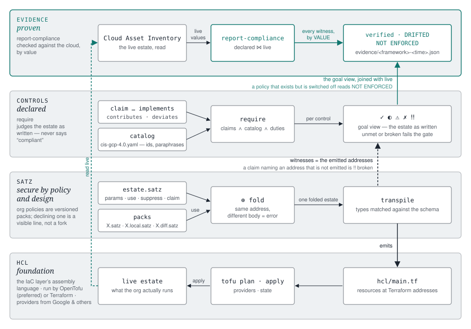

# Satz — language specification

**Version:** v0, as implemented in `crates/satz-core/src/satz.rs` (satz v0.46.0).
This document is derived from the parser, not from intent: where the two
disagree, the parser is right and this file is a bug. Every example below was
compiled on 2026-08-24 and the HCL shown is what came out — or it is lifted from
a shipped pack or a fleet estate, with the file named.

*Satz*: German for both **sentence** and **theorem** — a file is at once a
statement of intent and a provable claim. The two halves of that word are the
two halves of this document: how you *state* an estate, and how the statement
becomes something that can be *proven*.

Written for people who already run infrastructure as code and want to know,
precisely, what they gain and what they give up. Nothing is given up: Satz is
built on HCL, and every hour spent learning the provider carries over.

---

## 1. The layers

satz is four layers, and each one is a strictly stronger statement about the
estate than the one below it. HCL holds the resources. Satz decides which
resources exist and under whose policy. Claims say which control each resource
is *for*. Evidence checks that the control is *actually in force* — live, by
value.



| layer | what it holds | what it proves | command |
|---|---|---|---|
| **HCL** | resources, providers, state — the IaC layer's assembly language, run by OpenTofu (preferred) or Terraform, with providers from Google and others | that a resource *exists* as declared | `tofu plan` / `apply` |
| **Satz** | estate + packs, params, composition, suppressions | that the estate is a consistent, conflict-free fold of named, versioned parts — and that every org policy in it is *declared* on purpose | `transpile` |
| **Controls** | claims against a catalog | that each declared control has its witnesses *emitted* — a claim with a missing witness is reported, never silently satisfied | `require` |
| **Evidence** | the goal view joined with the live estate | that each witness is live and — for org policies — *enforcing*, by value; a policy switched off in the console is **NOT ENFORCED**, which outranks DRIFTED | `report-compliance` |

Two things the picture is careful about. First, the controls layer is **declared,
not proven**: `require` judges the estate as written and never says "compliant".
Only the evidence layer looks at the cloud, and even it states check semantics —
"a resource with these properties was verified at this time" — never legal
conformity. Second, the witness arrow points at **emitted HCL addresses**. That is
what ties the layers together: a claim is not prose about a control, it is a list
of Terraform addresses, so the same compile that produces `main.tf` produces the
evidence the claim will be checked against.

"Secure by policy and design" is the Satz layer's contribution, and it is a
property of the language rather than of any pack: org policies are ordinary
resources in versioned packs; a pack the estate includes never changes silently
(a semantic upstream change forks and repoints with proof); declining a control
is a visible one-liner that hard-errors when it goes stale; and there is no
escape hatch the proof layer cannot see, because `hcl { … }` warns on every
transpile until someone signs it.

---

## 2. HCL is the foundation — and you keep all of it

HCL is the language of the IaC layer: the assembly code that OpenTofu (the
preferred tool) or Terraform executes against provider plugins from Google and
others. Satz compiles to it. It does not wrap it, rename it, or hide it.

**There is no Satz provider documentation, on purpose.** The OpenTofu registry
and the HashiCorp registry are the documentation. Resource type names are the
provider's, to the underscore. Attribute names are the provider's, to the
underscore — across six real resource pairs from fleet estates (bucket, org
policy, IAM grants, conditional grant, log metric + alert policy, folder/project
hierarchy) **not one attribute name differs**. What you know about
`google_storage_bucket` from the registry page is what you write.

### 2.1 One resource, both ways

The audit-log bucket from the shipped `organization-audit-logsink` pack, as
written and as emitted for estate 1 (`presets/monitoring/organization-audit-logsink.satz:53`
→ `hcl/main.tf:2363`):

```
google_storage_bucket {
  org_audit_logs {
    project  = "${{google_project.logsink_project.project_id}}"
    name     = logsink_bucket_name
    location = logsink_bucket_location
    storage_class = "NEARLINE"
    uniform_bucket_level_access = true
    public_access_prevention    = "enforced"
    lifecycle_rule = [
      { action { type = "Delete" }
        condition { age = logsink_retention_days } },
    ]
  }
}
```

```hcl
resource "google_storage_bucket" "org_audit_logs" {
  provider = google.google
  project = "${google_project.logsink_project.project_id}"
  name = "acme-organization-audit-bucket"
  location = "europe-west3"
  storage_class = "NEARLINE"
  uniform_bucket_level_access = true
  public_access_prevention = "enforced"

  lifecycle_rule {
    action {
      type = "Delete"
    }

    condition {
      age = 400
    }
  }
}
```

Every attribute — `project`, `name`, `location`, `storage_class`,
`uniform_bucket_level_access`, `public_access_prevention`, `lifecycle_rule`,
`action.type`, `condition.age` — is the provider's name. Where the text differs,
it differs for a reason:

| HCL | Satz | why |
|---|---|---|
| `resource "google_storage_bucket" "org_audit_logs" {` | `google_storage_bucket { org_audit_logs { … } }` | the type is a **map** of resources, so two files can contribute to it and the fold can merge them |
| `provider = google.google` | *(not written)* | derived from where the resource sits — org, folder, or project — never repeated by hand |
| `name = "acme-organization-audit-bucket"` | `name = logsink_bucket_name` | a bare identifier is a **param**; the estate binds it, the pack declares the default |
| `"${google_project…}"` | `"${{google_project…}}"` | `{…}` interpolates params, so a literal brace is doubled |
| `lifecycle_rule { } lifecycle_rule { }` | `lifecycle_rule = [ { … }, { … } ]` | a repeated block is a **list value** — it can be overridden as one thing, and the fold can compare it |
| *(quoted label if it has `-`)* | `"compute-managed-requireOsLogin" {` | labels are identifiers or strings; hyphens become underscores in the address |

### 2.2 The complete list of transformations

Nine, all syntactic. If it is not on this list, Satz did not change it.

1. `resource "T" "L" {` → `T { L { } }`. Label quoted only when it is not an
   identifier; `-` → `_` in the emitted address.
2. `provider = …` is emitted, never written.
3. A bare identifier is a param and is emitted as its resolved **literal** —
   never `var.x` (params also become `variable`s in `variables.tf` with values in
   `terraform.tfvars`, for reference; resources do not point at them).
4. `"{param}"` in a string interpolates; `${{…}}` → `${…}`.
5. A list of objects `x = [ {…}, {…} ]` emits repeated `x { }` blocks. A
   single block `x { }` is unchanged.
6. `labels { k = "v" }` (block syntax) → `labels = { "k" = "v" }` (map attribute).
7. **IAM grants** — the one shape that is not 1:1: `"member" = [roles…]` emits one
   `*_iam_member` resource per (member, role, condition), with a hashed label and
   `role` / `member` / `org_id`-or-`project` synthesized.
8. Hierarchy **is** the parent reference: a `google_folder` inside a folder emits
   `parent = google_folder.<outer>.name`; a `google_project` inside a folder
   emits `folder_id = …`; a top-level folder gets `parent = "organizations/<id>"`.
9. Org policy `name` is written as the bare constraint
   (`compute.managed.requireOsLogin`) and emitted as the full
   `organizations/<id>/policies/<constraint>` — the one attribute whose *value*
   is expanded.

That is the whole tax. Everything else is registry knowledge, unchanged.

---

## 3. What Satz adds on top

The layers diagram reads bottom-up; this section reads the same way. Each
addition is one line or a few, shown against the shipped CIS pack.

**Include a pack** — 23 controls, 18 org policies, one line:

```
google_org_policy_policy {
  use "presets/CIS-GCP-Foundation-4.0.satz"
}
```

**Tune it without forking** — the pack declares a default, the estate binds it.
estate 3 keeps its contact addresses on a different domain than its organisation, so:

```
params {
  essential_contacts_allowed_domain = "example.net"
}
```

**Decline one control it provides** — no fork, one line, and it fails loudly the
day upstream retires the policy:

```
suppress google_org_policy_policy "compute-managed-requireOsLogin"
```

**Say why, on the record** — so the control reads ⚠ *deviation* in every report
instead of a false ✓ or an oversight-looking ✗:

```
claim "cis-gcp" "4.0" "4.4" deviates {
  resources = ["google_org_policy_policy.compute_managed_requireOsLogin"]
  reason    = "A service here depends on metadata SSH keys; enforcing OS Login breaks it."
  duty_reassess = "Re-assess when that service supports OS Login."
}
```

**Include a bare list as a map's content**, or **conditionally**:

```
use "presets/policies-pack.satz" as google_org_policy_policy
use "presets/optional-pack.satz" when want_optional
```

Fourteen organisations run that same pristine pack today. The differences
between them are params and, on three of them, a `.local` fork; everything else
is byte-identical to upstream and `check-presets` proves it.

---

## 4. What makes the layers possible

Each layer exists because a handful of language features make it expressible.

**Params with interpolation** are why a pack can be pristine and still fit a
customer. Outer beats inner; everything globally unique derives from
`customer_shortname`, everything org-scoped from `customer_organization_id`.

**Schema-typed resources** are why the fold is safe. Block keys are matched
exactly against the loaded provider schemas, so the compiler tells a resource
map from a nested attribute block without guessing, and an unknown type is a
parse-time error, not a plan-time one.

**`use` and the ⊕ fold** are why an estate is a composition rather than a copy.
Two files defining the *same address differently* is a conflict naming both
locations — composition is something the compiler checks.

**`suppress`** is why customisation stays small: subtractive, one line, and a
hard error when it matches nothing.

**`claim` / `deviates`** are why the controls layer is language, not a sidecar:
read from the same compile, naming emitted addresses.

**`hcl trust`** is why the escape hatch is visible: raw HCL warns on every
transpile until someone writes down why.

**Provenance by suffix** is why updates are safe on a fleet: the filename says
who owns the file, the tooling enforces it, and the diff file is regenerated on
every merge.

---

## 5. How much shorter, measured

Three numbers, all from the fleet on 2026-08-24, counting code lines (blank and
comment-only lines removed on both sides):

| what is compared | median | range | typical estate |
|---|---|---|---|
| **the estate file a customer writes** vs the HCL it becomes | **6.3×** | 2.9× – 10.6× | estate 8: 174 → 1 100 lines, 127 resources |
| all Satz sources incl. packs vs HCL | 1.8× | 1.4× – 3.7× | estate 8: 618 → 1 100 |
| the CIS pack alone vs its 18 policies' HCL | 0.66× | — | 298 → 197 |

The first row is the honest form of "much shorter": what you maintain per
organisation is a sixth of what runs. The high end (estate 1, estate 2 at ~10×) are the
estates that `use` the most pristine packs; the low end (estate 15, estate 5 at ~3×) are
estates with forked or inlined packs.

The second row explains the first. Packs are *not* short — they carry their
params' reasoning as comments and their control claims in-file, none of which
emits HCL — and the third row is the extreme case: the CIS pack is longer than
the policies it produces, because 66 of its lines are claims and 40 are the
reasoning behind two lists. That is the trade: the source is where the
compliance story lives, so the source is bigger than the output would suggest.

Where line count is not the point, **what you have to touch** is:

| to… | HCL / the YAML dialect | Satz |
|---|---|---|
| decline one control a pack provides | fork the pack | one `suppress` line in the estate |
| override one preset value | copy-edit, or define the anchor above the include in order | bind the param, any order |
| say why a control is not met | nowhere | `claim … deviates { reason = "…" }` |
| know whether a pack changed upstream | diff by hand | `check-presets` — canonical form of the parsed pack |
| keep the compliance story with the code | a sidecar file | claims in the pack, same compile |

---

## 6. Language reference

Every example in this section compiled on 2026-08-24 against the full
google/google-beta 7.12.0 schema; where HCL is shown, it is the emitted text.

### 6.1 Lexical structure

**Comments**

```
# hash to end of line
// slashes to end of line
/* block comment,
   may span lines */
```

**Identifiers** — `[A-Za-z_][A-Za-z0-9_]*`, conventionally `snake_case`. Used for
param names, block keywords, resource types, map keys and param references.

**Numbers and booleans** — bare literals (`400`, `1.5`) and `true` / `false`.

**Strings** — single-line, double-quoted; multi-line, triple-quoted (the only
form that may contain a raw newline; content is literal):

```
"europe-west3"

"""
first line
second line
"""
```

**Escapes** (single-line only): `\n`, `\"`, `\\`. Any other escape is an error.

**Interpolation** — `{param_name}` inside any string splices a param's value.
The name must be `[A-Za-z0-9_]+` and terminated by `}`.

```
parent = "organizations/{customer_organization_id}"
email  = "essential-contacts-all@{customer_domain}"
```

**Literal braces are doubled**, because Terraform's `${…}` and JSON policy
parameters both contain braces:

```
parameters = "{{\"allowedDomains\" : [\"@{customer_domain}\"]}}"
             ↑↑ literal { }                      ↑ interpolated param

value = "${{google_project.x.project_id}}"   # a literal Terraform reference
```

Rule of thumb: **`{x}` is Satz, `{{` is a brace you want to survive.**

### 6.2 File structure

```ebnf
file    := [ header ] { item }
header  := ("estate" | "pack") IDENT { "content" | "version" STRING }
item    := "params" "{" { param } "}"
         | "use" STRING [ "as" IDENT ] [ "when" IDENT ]
         | "claim" STRING STRING STRING COVERAGE "{" { claim-entry } "}"
         | "suppress" IDENT STRING [ "role" STRING ]
         | "hcl" [ "trust" STRING ] "{" … "}"
         | block
```

**Header**

```
estate acme                        # a customer estate
pack   monitoring.audit_logsink version "1.1"
pack   essential_contacts_organization version "1.1" content
```

- `estate` — one customer organisation. Usually one per repo.
- `pack` — a reusable unit. `version` is the pack's own revision, deliberately
  **in-file, never in the filename** (framework versions live in claims and are
  orthogonal: several pack revisions may implement the same standard).
- `content` — marks a pack that is *expected* to be edited per customer; forking
  it to `<name>.local.satz` is the normal workflow. Reporting tone only.

The header is optional in fragment files that are only ever `use`d.

### 6.3 Params

Params are **declarations with defaults**:

```
params {
  customer_organization_id = "123456789012"
  customer_shortname       = "acme"
  retention_days           = 400
  versioning_enabled       = true
  extra_members            = []
  audit_bucket_name        = "{customer_shortname}-audit-001"
  log_bucket_name          = audit_bucket_name       # bare identifier = param reference
}
```

Resolution rules:

1. A value bound by the *using* document wins over the file's own default
   (outer beats inner — that is what makes a pack configurable).
2. Params may reference each other **regardless of declaration order**; the
   compiler sorts by dependency.
3. The namespace is one document-ordered space: packs see every earlier file's
   params. (True lexical pack scoping is a deliberate future change, not v0.)
4. Overriding a **list replaces it** — v0 has no concatenation — so an estate
   that adds to a pack's list repeats the entries it keeps.

What the compiler does with them: every param becomes a typed `variable` in
`variables.tf` (underscores → hyphens; `[]` is typed `list(string)`) with its
resolved value in `terraform.tfvars`, for anyone reading the HCL — but a
resource that references a param is emitted with the **literal**, never `var.x`:

```hcl
# variables.tf
variable "audit-bucket-name" { type = string }
variable "retention-days"    { type = number }
variable "extra-members"     { type = list(string) }

# terraform.tfvars
audit-bucket-name = "acme-audit-001"
log-bucket-name   = "acme-audit-001"      # the alias resolved fully

# main.tf — the resource carries the value
resource "google_storage_bucket" "probe" {
  provider = google.google
  name = "acme-audit-001"
  location = "EU"
}
```

A pack's params are its contract, and the comment travels with the default.
From the shipped CIS pack:

```
pack CIS_GCP_Foundation_4_0 version "2.1"

params {
  // essentialcontacts.managed.allowedContactDomains: the domain whose addresses
  // may be set as essential contacts. Default = the customer's own domain. Some
  // customers keep their contact addresses on a DIFFERENT domain than the org
  // (estate 3: org example.com, contacts @example.net) — set it here rather
  // than forking the pack.
  essential_contacts_allowed_domain = customer_domain
}
```

### 6.4 Blocks, entries and resources

```ebnf
block   := KEY [ NAME ] "{" { entry } "}"
entry   := KEY "=" value                  attribute
         | KEY "{" { entry } "}"          nested mapping
         | KEY NAME "{" { entry } "}"     named map entry
         | "use" STRING [ … ]             include inside this mapping
KEY     := IDENT | STRING                 (a string key may interpolate)
NAME    := IDENT | STRING
value   := STRING | NUMBER | true | false | IDENT
         | "[" [ value { "," value } [ "," ] ] "]"
         | "{" { entry } "}"
```

List items may be separated by commas **or** newlines; a trailing comma is
allowed.

**The resource types are the ones the provider schemas declare**, matched
exactly: `google_org_policy_policy`, `google_folder`, `google_project`. A key
the loaded schemas do not know is a hard error. That applies to types nested
inside a `google_project { … }` or `google_folder { … }` body as well, which
are otherwise indistinguishable from a nested attribute block such as
`labels { … }` — the schema is what tells the two apart.

The only bare block keywords are Satz's own: `estate`, `pack`, `params`,
`terraform`, `providers`, `use`, `suppress`, `claim`, `hcl`.

**Simple** — one org policy:

```
google_org_policy_policy {
  "compute-managed-requireOsLogin" {
    name   = "compute.managed.requireOsLogin"
    parent = "organizations/{customer_organization_id}"
    spec {
      rules = [ { enforce = "TRUE" } ]
    }
  }
}
```

```hcl
resource "google_org_policy_policy" "compute_managed_requireOsLogin" {
  provider = google.google
  name = "organizations/123456789012/policies/compute.managed.requireOsLogin"
  parent = "organizations/123456789012"

  spec {
    rules {
      enforce = "TRUE"
    }
  }
}
```

The label has a hyphen, so it is quoted; the address has an underscore, and
that address — `google_org_policy_policy.compute_managed_requireOsLogin` — is
what a claim names.

**Proving** — a bucket with a nested block, a single block, and a *repeated*
block:

```
google_storage_bucket {
  audit_logs {
    name     = audit_bucket_name
    location = "EU"
    uniform_bucket_level_access = true
    versioning       { enabled = true }
    retention_policy { retention_period = 34560000 }
    lifecycle_rule = [
      {
        action    { type = "Delete" }
        condition { age = 730 }
      },
      {
        action    { type = "SetStorageClass" storage_class = "COLDLINE" }
        condition { age = 90 }
      }
    ]
  }
}
```

```hcl
resource "google_storage_bucket" "audit_logs" {
  provider = google.google
  name = "acme-audit-001"
  location = "EU"
  uniform_bucket_level_access = true

  versioning {
    enabled = true
  }

  retention_policy {
    retention_period = 34560000
  }

  lifecycle_rule {
    action {
      type = "Delete"
    }

    condition {
      age = 730
    }
  }

  lifecycle_rule {
    action {
      type = "SetStorageClass"
      storage_class = "COLDLINE"
    }

    condition {
      age = 90
    }
  }
}
```

**A repeated block is a list of objects.** Do not write `lifecycle_rule { … }`
twice: in v0 that parses and keeps only the last one, silently (#34). The list
form is the only correct one.

`google_cloud_identity_group` is a satz abstraction that shares a Terraform
type name: it is expanded into a group resource (deriving `group_key`, `parent =
customers/<id>` and the discussion_forum/security labels) rather than passed
through.

### 6.5 IAM grants

Grant resources take a **member → roles** shape. The member is the key, usually
interpolated; a role is a string, or an object when it carries a condition:

```
google_organization_iam_member {
  "group:gcp-org-admins@{customer_domain}" = [
    "roles/resourcemanager.organizationAdmin",
    "roles/iam.organizationRoleAdmin",
  ]
  "group:gcp-auditors@{customer_domain}" = [
    {
      role = "roles/storage.objectViewer"
      condition {
        title      = "audit-objects-only"
        expression = "resource.name.startsWith(\"projects/_/buckets/x/objects/y\")"
      }
    },
  ]
}
```

```hcl
resource "google_organization_iam_member" "iam_group_gcp_auditors_example_com_96115764c9f71ca9" {
  role = "roles/storage.objectViewer"
  member = "group:gcp-auditors@example.com"
  org_id = "123456789012"

  condition {
    title = "audit-objects-only"
    expression = "resource.name.startsWith(\"projects/_/buckets/x/objects/y\")"
  }

  provider = google.google
}

resource "google_organization_iam_member" "iam_group_gcp_org_admins_example_com_3fb0828564be6711" {
  role = "roles/iam.organizationRoleAdmin"
  member = "group:gcp-org-admins@example.com"
  org_id = "123456789012"
  provider = google.google
}

resource "google_organization_iam_member" "iam_group_gcp_org_admins_example_com_21d2774f810ee5df" {
  role = "roles/resourcemanager.organizationAdmin"
  member = "group:gcp-org-admins@example.com"
  org_id = "123456789012"
  provider = google.google
}
```

One resource per (member, role, condition). `org_id` comes from
`customer_organization_id`; inside a `google_project { … }` it is `project =
google_project.<label>.project_id` and a per-project provider alias instead.
The condition is hashed into the address, so the same role to the same member
under two conditions is two resources. Emission order is by address, not by
source order.

A grant scoped to a **bucket** is a plain labelled resource, not a member map:

```
google_storage_bucket_iam_member {
  audit_viewer {
    bucket = "${{google_storage_bucket.audit_logs.name}}"
    role   = "roles/storage.objectViewer"
    member = "group:gcp-auditors@{customer_domain}"
  }
}
```

Memberships stay **out of packs**: packs define groups, humans grant membership.

### 6.6 Folders and hierarchy

Nesting **is** the parent reference — `parent` and `folder_id` are never written:

```
google_folder {
  workloads {
    display_name = "Workloads"
    google_folder {
      team_alpha {
        display_name = "Team Alpha"
        google_project {
          alpha_prod {
            name       = "{customer_shortname}-alpha-prod"
            project_id = "{customer_shortname}-alpha-prod-001"
            labels { env = "prod" }
          }
        }
      }
    }
  }
}
```

```hcl
resource "google_folder" "workloads" {
  display_name = "Workloads"
  parent = "organizations/123456789012"
  provider = google.google
}

resource "google_folder" "team_alpha" {
  display_name = "Team Alpha"
  parent = google_folder.workloads.name
  provider = google.google
}

resource "google_project" "alpha_prod" {
  project_id = "acme-alpha-prod-001"
  name = "acme-alpha-prod"
  provider = google.google
  folder_id = google_folder.team_alpha.name
  labels = {
    "env" = "prod"
  }
}
```

Read the two `{ }` bodies inside `alpha_prod` against each other:
`google_folder { … }` is a schema type and became a resource;
`labels { … }` is an attribute and became `labels = { … }`. Same syntax; the
schema decided.

Known v0 defect (#33): the folder emitter writes `display_name`, `parent`,
`provider`, `labels` and `lifecycle` only — `deletion_protection` written on a
folder is dropped without a warning today. Projects are not affected.

### 6.7 Adoption of existing resources

`"import-id"` records the live id so the tool adopts rather than creates. It
is the only adoption surface in the language — the *result* of resolving a
live resource, declarative and visible in `tofu plan` — and it is honoured on
every resource the compiler emits:

```
google_folder {
  workloads {
    "import-id"  = "folders/123456789"
    display_name = "workloads"
    google_project {
      infra {
        "import-id"     = "acme-infra-001"
        project_id      = "acme-infra-001"
        project_service = [
          "logging.googleapis.com",
          { service = "storage.googleapis.com" "import-id" = "acme-infra-001/storage.googleapis.com" },
        ]
      }
    }
  }
}

google_organization_iam_member {
  "group:gcp-org-admins@{customer_domain}" = [
    "roles/viewer",
    { role = "roles/browser" "import-id" = "123456789012 roles/browser group:gcp-org-admins@example.com" },
  ]
}

google_cloud_identity_group {
  gcp_auditors {
    "import-id" = "groups/00abc"
    member = [
      "user:a@{customer_domain}",
      { id = "user:b@{customer_domain}" "import-id" = "groups/00abc/memberships/111" },
    ]
  }
}
```

Every `"import-id"` becomes one `import { to = <address> id = "…" }` block in
`hcl/imports.tf`, addressed exactly as the resource is emitted (hashed labels
for bindings and memberships included), and is stripped from the resource
body. Where the resource is an *entry* rather than a block — a role in a
grant list, a service in `project_service`, a member of a group — the entry
takes its object form and carries the id there. An IAM binding declared with
and without an id (a pack's grant that the estate adopts) is one resource;
two different ids for the same binding is an error.

You rarely write these by hand: `satz adopt <estate>` resolves the live ids of
everything the estate declares — folders by display name under their parent,
groups by email, org policies by constraint (activating managed constraints
with `--activate`), user-chosen ids from the rules in
`presets/discovery-config.yaml` — and `--execute` writes the verified ones back
as `"import-id"`. A resolution with more than one live candidate is reported as
ambiguous and left for you to pin; nothing is ever guessed.

### 6.8 Estate configuration blocks

`terraform` and `providers` are configuration, not resources:

```
terraform {
  backend {
    local { path = "terraform.tfstate" }
    gcs {
      bucket = infra_bucket_name
      prefix = "hcl/state"
    }
  }
}

providers {
  "google" {
    project               = infra_project_name
    region                = default_region
    alias                 = "google"
    user_project_override = true
    billing_project       = infra_project_name
  }
}
```

### 6.9 `use` — composition

```
use "presets/CIS-GCP-Foundation-4.0.satz"
use "presets/CIS-GCP-Foundation-4.0.satz" as google_org_policy_policy
use "presets/optional-pack.satz" when want_optional
```

- **Path** is a plain string, never interpolated. Resolved relative to the using
  file first, then the configured `include_dirs`.
- **`as <key>`** — the pack's top-level entries become the *content* of a
  resource map keyed by `<key>`. For a pack that is a bare list of resources.
- **`when <param>`** — the pack is pulled in only if the param is truthy. A
  skipped pack contributes nothing: no resources, no params, no claims.

`use` is valid at three places, and all three behave identically with respect
to params, claims and `hcl` blocks: top level; inside a `google_folder { … }`
block; and inside a resource map, **the most common form in real estates**.

**Proving** — a pack with a default, an estate that overrides it, and a bare-list
pack included `as` a map. `pack.satz`:

```
pack docs_example_pack version "1.0"

params {
  pack_bucket_location = "EU"
}

google_storage_bucket {
  pack_bucket {
    name     = "{customer_shortname}-pack-bucket-001"
    location = pack_bucket_location
  }
}
```

`policies-pack.satz` — labels at the top level, no type:

```
pack docs_policies_pack version "1.0"

"compute-managed-requireOsLogin" {
  name   = "compute.managed.requireOsLogin"
  parent = "organizations/{customer_organization_id}"
  spec {
    rules = [ { enforce = "TRUE" } ]
  }
}
```

The estate:

```
estate acme

params {
  customer_organization_id = "123456789012"
  customer_shortname       = "acme"
  pack_bucket_location     = "europe-west3"     # overrides the pack's "EU"
}

use "pack.satz"
use "policies-pack.satz" as google_org_policy_policy
```

Emits `google_storage_bucket.pack_bucket` with `location = "europe-west3"`
(remove the estate's param and it emits `"EU"` — verified both ways) and the
same `google_org_policy_policy.compute_managed_requireOsLogin` block as §6.4.

Composition is a **fold**: two files may contribute to the same resource map
and the results merge. Two files defining the *same address differently* is a
conflict and a hard error naming both source locations.

### 6.10 `suppress` — the subtractive channel

An estate declines something a pack provides, without forking the pack:

```
suppress google_org_policy_policy "compute-managed-requireOsLogin"
suppress google_organization_iam_member "group:sec@{customer_domain}" role "roles/browser"
```

- Type is the **full** Terraform type name; the label may interpolate.
- `role "<role>"` narrows the suppression to one edge of a grant instead of the
  whole member.

Against the estate above, the first line removes the policy from `main.tf` and
nothing else changes. Suppressions apply before conflict detection, so
suppressing a conflicted address resolves the conflict.

A suppression that matches nothing is a **hard error**:

```
suppress google_org_policy_policy "compute-managed-noSuchPolicy" matches nothing — stale suppression (typo or upstream rename)
```

A stale suppression silently doing nothing is exactly the failure this channel
exists to prevent, and it has earned its keep once already: when the CIS pack
retired the legacy §1.1 constraint in v2.0, every estate still carrying a
`suppress` for it failed on the next transpile instead of keeping a dead line
forever.

### 6.11 `claim` — the compliance plane

Claims are language syntax, read directly from the source by `require` and
`report-compliance`. They leave no trace in `main.tf`.

```
claim "cis-gcp" "4.0" "1.4" implements {
  resources = [
    "google_org_policy_policy.iam_managed_disableServiceAccountKeyCreation",
    "google_org_policy_policy.iam_managed_disableServiceAccountKeyUpload",
  ]
  interpretation       = "Service account keys cannot be created or uploaded."
  duty_rotate_existing = "Existing user-managed keys must be removed by hand."
}
```

```ebnf
claim FRAMEWORK VERSION CONTROL COVERAGE "{" { claim-entry } "}"
COVERAGE    := "implements" | "contributes" | "deviates"
claim-entry := "resources" "=" "[" { STRING } "]"
             | "interpretation" "=" STRING
             | "reason" "=" STRING            (deviates only, required)
             | "duty_" IDENT "=" STRING
```

- The three header strings are plain — **no interpolation**; control ids are
  static.
- `resources` are emitted Terraform addresses. A claim whose witnesses are not
  emitted is a **broken claim** (‼), reported loudly, never silently satisfied.
- `duty_<name>` records a manual duty; underscores become hyphens in reports
  (`duty_validate_then_lock` → `validate-then-lock`).
- `implements` discharges the control; `contributes` is a necessary part.

The catalog the claim is judged against is data
(`presets/catalogs/cis-gcp-4.0.yaml`): control ids, this project's own
paraphrases, and an `automatability` (`technical` / `partial` /
`organizational`) — never framework prose, which is licence-restricted.

A duty is where the claim records what code cannot do. From the shipped pack:

```
claim "cis-gcp" "4.0" "4.4" implements {
  resources = ["google_org_policy_policy.compute_managed_requireOsLogin"]
  interpretation    = "OS Login is required, so VM SSH access is governed by IAM rather than metadata keys."
  duty_existing_vms = "Enforcing OS Login can cut existing SSH access patterns; verify before enabling on an org with running VMs."
}
```

Until that duty is attested (§8), the control reads ◐ *partial (open duty)* —
witnesses present, human step outstanding.

**`deviates` — declining a control on purpose**

```
claim "cis-gcp" "4.0" "4.4" deviates {
  resources = ["google_org_policy_policy.compute_managed_requireOsLogin"]
  reason    = "A service here depends on metadata SSH keys; enforcing OS Login breaks it."
  duty_reassess = "Re-assess when that service supports OS Login."
}
```

`reason` is **mandatory** on a deviation and **rejected** on the other kinds.
Leave it out and the compile stops:

```
claim … deviates: reason = "…" is required (a deviation is a disclosed decision, and the report carries the reason)
```

Witnesses are optional here — the resource may be present-but-not-enforcing, or
absent because the estate suppressed it — but any witness the claim *does*
declare must still be emitted, so deleting the policy outright resurfaces as a
broken claim rather than staying silently "deviated". A deviation renders as ⚠
with its reason, is counted separately, and does **not** fail the `require`
gate: a disclosed decision, not a gap. It outranks the claims it contradicts
and can be declared by a pack fork or by the estate itself.

### 6.12 `hcl` — raw passthrough

```
hcl {
  resource "google_compute_address" "legacy" {
    name   = "legacy-ip"
    region = "europe-west3"
  }
}

hcl trust "reviewed 2026-08-24, provider gap for static IPs" {
  resource "google_compute_address" "legacy_trusted" {
    name   = "legacy-ip-2"
    region = "europe-west3"
  }
}
```

The body is captured verbatim, is **never interpolated**, and bypasses the fold
entirely — which is what "opaque to the proof layer" means. Every transpile says
so:

```
warning: raw HCL passthrough at yaml/main.satz:14 (4 lines) emitted verbatim — opaque to the compliance plane; no claim can cover it. Add `hcl trust "<reason>" { … }` once reviewed.
note: raw HCL passthrough at yaml/main.satz:21 (4 lines) — trusted: reviewed 2026-08-24, provider gap for static IPs
```

and so does the output:

```hcl
# --- raw HCL passthrough from yaml/main.satz:21 ---
# Opaque to the compliance plane: no claim covers what is written here.
# trusted: reviewed 2026-08-24, provider gap for static IPs
resource "google_compute_address" "legacy_trusted" {
  name   = "legacy-ip-2"
  region = "europe-west3"
}
```

Escape hatch by design, visible by design. "Opaque" is a property the compiler
enforces, not a convention: the compliance plane reads the *emission manifest*
— the resources the compiler itself built — never the rendered `main.tf`, and
the passthrough is appended to the text after emission. A resource that exists
only inside `hcl { … }` therefore deploys but is **not a witness**; a claim
that names it reports **‼ broken claim**, exactly as if the resource were
missing.

### 6.13 Provenance: pristine, fork, ledger

Suffix carries meaning; the tooling enforces it.

| file | meaning |
|---|---|
| `X.satz` | pristine, upstream-owned, always overwritable |
| `X.local.satz` | customer fork, never touched by updates |
| `X.diff.satz` | the current adoption delta (fork vs pristine), rewritten each merge |

- A preset the estate **includes** never changes silently. A semantic upstream
  change (the canonical form of the parsed pack differs — params or body)
  auto-forks and repoints the estate. Comment, format and version-line churn
  upgrades silently.
- Pack versions live **in-file**; filenames carry only framework versions.
  Never `X.local.2.satz`.
- 80% of customisation should be **params**; the rest a `.local` fork. A fork
  whose entire diff could have been a param is upstream debt.

---

## 7. Proof: `require`

**What you gain:** a gate, before anything touches the cloud, that says which
controls the estate *as written* discharges — and refuses to be fooled by a
claim whose witness is not there.

```
satz require cis-gcp-4.0 C0example1.satz --config ~/estates/acme
```

```
require cis-gcp 4.0 — goal view for …/acme/yaml/C0example1.satz

  ◐ 1.1   Corporate login credentials only              — open duties: legacy-superseded, review-allowlist
  ✓ 1.4   Only GCP-managed service account keys         — google_org_policy_policy.iam_managed_disableServiceAccountKeyCreation, google_org_policy_policy.iam_managed_disableServiceAccountKeyUpload
  ✓ 2.2   Sinks for all log entries                     — google_logging_organization_sink.organization_audit_gcs, google_storage_bucket.org_audit_logs, google_storage_bucket_iam_member.org_audit_sink_writer
  ◐ 2.3   Retention on the log bucket                   — no implements claim included
  ✓ 3.1   Default network does not exist                — google_org_policy_policy.compute_skipDefaultNetworkCreation
  ◐ 4.4   OS Login enabled                              — open duties: existing-vms
  ✓ 5.2   Uniform bucket-level access enabled           — google_org_policy_policy.storage_uniformBucketLevelAccess

18 satisfied, 5 partial, 0 deviation(s), 0 unmet, 0 broken claim(s). Goal view judges the DECLARED estate; live verification is the evidence report.
```

(Trimmed to seven of 23 rows.) Every ✓ carries its witnesses — the emitted
addresses the claim named and the compiler found. Rows are the catalog's
controls, string-sorted by id.

On an estate that declines two controls (estate 5, a fork with `enforce = "FALSE"`
and a `deviates` claim for each), the same command reads:

```
  ⚠ 4.4   OS Login enabled                              — DEVIATION (CIS_GCP_Foundation_4_0) Deliberate: an operational service in this organisation depends on metadata SSH keys, which enforcing OS Login would break. The constraint is declared and managed here, with enforce = FALSE, so the decision is visible in the estate rather than absent from it. open: identify-service, reassess
  ⚠ 4.6   IP forwarding not enabled on instances        — DEVIATION (CIS_GCP_Foundation_4_0) Deliberate: workloads in this organisation require IP forwarding, so the constraint is declared and managed with enforce = FALSE rather than left undeclared. open: identify-workloads, reassess

7 satisfied, 3 partial, 2 deviation(s), 11 unmet, 0 broken claim(s). …
Deviations are disclosed decisions with a stated reason, not gaps — they do not fail this gate.
```

And on an estate with no CIS pack at all (estate 7), every row says what would
provide it:

```
  ✗ 1.4   Only GCP-managed service account keys         — unmet. Provides: CIS_GCP_Foundation_4_0
  ✗ 2.2   Sinks for all log entries                     — unmet (no pack in the library provides it)
```

| glyph | status | meaning (`src/compliance.rs`) |
|---|---|---|
| ✓ | satisfied | ≥1 `implements` claim from an included pack, every witness emitted, no open duties |
| ◐ | partial | witnesses present but duties open, or only `contributes` claims |
| ⚠ | deviation | a deliberate non-conformance with a stated reason — disclosed, never counted as a gap |
| ✗ | unmet | no included pack claims it; names the packs in the library that would |
| ‼ | broken claim | an included pack claims it but its declared witnesses are not emitted — worse than unmet |
| ○ | organizational | the catalog marks it as having no IaC witness |

Exit code is **1 when anything is unmet or broken**, 0 otherwise. Deviations do
not fail it. That is the CI gate: an estate that drops a witness a claim
depends on fails the build, and an estate that declines a control on the
record does not.

---

## 8. Evidence: `report-compliance`

**What you gain:** the goal view joined with the cloud. Every witness of a
satisfied or partial control is looked up through Cloud Asset Inventory — and
for org policies, compared **by value**, because a policy that exists and is
switched off looks healthy in every inventory.

```
satz report-compliance cis-gcp-4.0 C0example1.satz --config ~/estates/acme
```

Three rows from estate 1's report, one of each shape:

| Control | Status | Witnesses (declared → live) | Duties |
|---|---|---|---|
| 1.4 | **verified** | `google_org_policy_policy.iam_managed_disableServiceAccountKeyCreation` → ✓ `organizations/123456789012/policies/iam.managed.disableServiceAccountKeyCreation` · `…KeyUpload` → ✓ `…KeyUpload` | – |
| 2.1 | verified* | two org policies → ✓ · `google_organization_iam_audit_config.org_all_services` → – (no live check for this type yet) | – |
| 2.3 | partial (open duty) | `google_storage_bucket.org_audit_logs` → ✓ `acme-organization-audit-bucket` | open: validate-then-lock |

Status precedence, highest first:

1. **NOT ENFORCED** — a witness is live but not doing what the estate declares
   (an org policy's `enforce` differs). Outranks DRIFTED on purpose: a missing
   resource is visibly absent; a present-but-off one is invisible.
2. **DRIFTED** — a declared witness is not live.
3. **partial (open duty)** — unattested duties remain.
4. **partial (contributes)** — only `contributes` claims.
5. **verified\*** — at least one witness has no live check for its type yet.
   Stated, never faked.
6. **declared** — `--no-live`, or an empty inventory.
7. **verified** — every witness matched live.

Plus **deviation (accepted)**, **deviation is STALE** (declared as a deviation,
but the live policy actually enforces — the fork is behind reality), **BROKEN
CLAIM**, **unmet**, and organizational. The comparison refuses to guess: a
policy with several rules, with none, or a list constraint yields no verdict
rather than a wrong one, and a policy whose live state cannot be read reports
*unverifiable*, never *verified*.

**Attestations** discharge manual duties. `attestations.yaml` beside
`config.toml`, one entry per duty id:

```yaml
validate-then-lock:
  by:   "Jane Doe"
  date: "2026-08-20"
  note: "bucket lock applied after 30-day pipeline validation"
```

An attested duty moves from `open: validate-then-lock` to
`attested: validate-then-lock (Jane Doe, 2026-08-20)` and no longer holds the
control at partial. No estate in the fleet has one yet.

**Evidence history.** Every run appends `evidence/<framework>-<timestamp>.json`
beside the config — `estate`, `framework`, `version`, `live`, `verified_at`,
and one row per control with `control`, `title`, `status`, `witnesses`,
`duties`, `prowler` — and writes the report (`evidence/<framework>-latest.md`,
or `--format pdf`). `--prowler findings.json` ingests a Prowler export as
corroboration. `--no-live` produces a declared-only report (statuses read
*declared*) but still appends to the history. The report states check
semantics — "a resource with these properties was verified at this time" —
never legal conformity.

---

## 9. Quick reference

| I want to… | Write |
|---|---|
| declare an estate | `estate acme` |
| declare a versioned pack | `pack monitoring.logsink version "1.2"` |
| mark a pack as per-customer content | `pack contacts version "1.1" content` |
| declare a tunable | `params { region = "europe-west3" }` |
| reference a param in a string | `"organizations/{customer_organization_id}"` |
| reference a param as a value | `bucket = infra_bucket_name` |
| write a literal brace | `"{{"` / `"}}"` |
| write a Terraform reference | `"${{google_project.x.project_id}}"` |
| include a pack | `use "presets/x.satz"` |
| include as a resource map's content | `use "presets/x.satz" as google_org_policy_policy` |
| include conditionally | `use "presets/x.satz" when want_x` |
| declare a resource | `type { "label" { attr = … } }` |
| repeat a nested block | `lifecycle_rule = [ { … }, { … } ]` |
| grant roles | `google_organization_iam_member { "group:x@{domain}" = ["roles/viewer"] }` |
| grant conditionally | role becomes `{ role = "…" condition { title = … expression = … } }` |
| adopt an existing resource | `"import-id" = "folders/123"` |
| drop one pack resource | `suppress google_org_policy_policy "label"` |
| drop one grant edge | `suppress google_organization_iam_member "member" role "roles/x"` |
| claim a control | `claim "cis-gcp" "4.0" "1.4" implements { resources = [...] }` |
| record a manual duty | `duty_lock_bucket = "…"` inside a claim |
| decline a control on purpose | `claim … deviates { resources = [...] reason = "…" }` |
| escape into raw HCL | `hcl { … }` — warns unless `hcl trust "…" { … }` |
| multi-line string | `"""…"""` |
| comment | `#`, `//`, `/* … */` |

### Commands that consume this language

| command | layer | does |
|---|---|---|
| `transpile <estate>.satz` | Satz → HCL | emit `hcl/` |
| `require <framework> <estate>.satz` | Controls | goal view — declared estate vs catalog; exit 1 on unmet/broken |
| `report-compliance <framework> <estate>.satz` | Evidence | evidence report, verified against live; `--no-live`, `--prowler`, `--format pdf` |
| `check-presets <estate>.satz` | Satz | drift of packs vs upstream |
| `merge-presets` | Satz | reconcile pack updates; forks + repoints on semantic change |
| `adopt <estate>.satz [--execute] [--import] [--activate] [--only t,…]` | Satz | resolve live ids of declared resources, write `"import-id"`s or import; `adopt-org-policies` is an alias |
| `plan` / `apply` / `tf-init` | HCL | run the configured tool (`tf_tool`, OpenTofu by default) in `hcl_dir` |
| `migrate-to-satz <file>.yaml [--kind estate] [--gate <estate>.satz]` | — | convert from the legacy dialect; gated by compiling through the fragment pipeline (§12) |

All of them accept `--config <estate-dir-or-config.toml>` and run from anywhere.
The estate file is a positional argument, relative to `yaml_dir`.

---

## 10. Errors

Every error carries a line number and, where a fix exists, names it. Verbatim:

```
unterminated interpolation '{custome
empty interpolation {} (use {{}} for a literal brace)
newline in single-line string (use """ for multi-line)
unknown param 'no_such_param'
block `folder`: unknown resource type. Satz names Terraform types in full — write `google_folder`.
claim: resources = [...] is required (a claim ships its witnesses)
claim … deviates: reason = "…" is required (a deviation is a disclosed decision, and the report carries the reason)
suppress google_org_policy_policy "x" matches nothing — stale suppression (typo or upstream rename)
use "x.satz": file not found (searched beside the file and include_dirs)
composition conflicts: <type>.<label>: 2 disagreeing definitions
  - a.satz:12
  - b.satz:40
```

---

## 11. Known v0 limits

- **Param scoping is document-ordered, not lexical.** Packs see every earlier
  file's params. True lexical scoping is a future semantics change.
- **No list concatenation.** Overriding a list param replaces it.
- **Repeated block keys in one body last-win silently** (#34). Write repeated
  blocks as a list of objects.
- **`google_folder` emits a fixed attribute set** — `display_name`, `parent`,
  `labels`, `lifecycle`; `deletion_protection` is dropped (#33).
- **`use … when` is followed unconditionally when computing which presets an
  estate uses** (`check-presets`), so a conditionally-disabled pack may be
  reported as included. Over-reporting drift is the safe direction.
- **No `force` / priority channel.** "Keep my version of one pack resource" is
  a fork today; `suppress` + redeclare cannot express it because the
  redeclaration lands at the same address and folds to a conflict.
- **An estate with no resources emits no `main.tf`** — only `providers.tf`,
  `variables.tf` and `terraform.tfvars`.

---

## 12. Migration from the YAML dialect

satz's first surface language was a YAML dialect with custom tags. Since
v0.46.14 nothing reads it but `migrate-to-satz`: `transpile` and every other
command take `.satz` and refuse a `.yaml` estate with a pointer to the
converter. This section is everything a reader coming from that dialect needs,
and nothing a reader who never used it does. (Brownfield estates never need
the dialect: `discover-from-state` and `discover-from-organization` write a
Satz estate directly, through the same printer `migrate-to-satz` uses.)

**What changed at the surface:**

| YAML dialect | Satz |
|---|---|
| `org_policy_policy:` (implicit `google_`) | `google_org_policy_policy { … }` — the schema's type name |
| `&anchor` / `*anchor` | params are declarations; a bare identifier references one |
| `!format ["organizations/{}", *customer-organization-id]` | `"organizations/{customer_organization_id}"` |
| identity-`!format` aliasing | `a = b` |
| override an anchor *above* the `!include`, in textual order | bind the param; the compiler sorts by dependency |
| `!include x.yaml` / `!include-if anchor x.yaml` | `use "x.satz"` / `use "x.satz" when param` |
| `!expr google_x.y.z` | `"${{google_x.y.z}}"` — doubled braces |
| `<pack>.claims.yaml` sidecar | `claim … { … }` in the pack |
| `kebab-case` anchors | `snake_case` identifiers (the emitter maps `logsink_project_name` ↔ `logsink-project-name`) |

Side by side, one org policy:

```yaml
iam-managed-disableServiceAccountKeyCreation:
  name: iam.managed.disableServiceAccountKeyCreation
  parent: !format ["organizations/{}", *customer-organization-id]
  spec:
    rules:
      - enforce: "TRUE"
```

```
"iam-managed-disableServiceAccountKeyCreation" {
  name   = "iam.managed.disableServiceAccountKeyCreation"
  parent = "organizations/{customer_organization_id}"
  spec {
    rules = [ { enforce = "TRUE" } ]
  }
}
```

**How a conversion is checked.** `migrate-to-satz` converts a file and compiles
the result through the fragment pipeline — the pipeline that will actually read
it — and prints the emitted resource set (`CONVERTED: … N resources emitted`).
An estate is gated on itself; a pack is gated on the `.satz` estate you pass
with `--gate`, or only parsed when there is none. A conversion that cannot be
checked in context says `NEEDS-REVIEW`; the last word is `satz transpile` and a
`tofu plan` that shows no destroy for what the old estate managed. Interior
comments are not carried; the converter says so at the top of its output. An
estate that used the dialect's `!import-include` converts to a plain `use` with
a `NEEDS ADOPTION` note: run `satz adopt` afterwards.

**A limit worth knowing:** `use "x.yaml"` is accepted by the parser, but the
fragment pipeline cannot load a YAML pack — it reports `unexpected character
':'`. Convert the pack (`migrate-to-satz x.yaml --kind pack`).

**Why the dialect still parses at all:** to be migrated. That is the whole of
its support (owner decision, 2026-08-29): YAML is never transpiled or generated
by new functionality, and a YAML code path a cleanup breaks is removed rather
than repaired. A migrated estate may need a manual edit or two.
