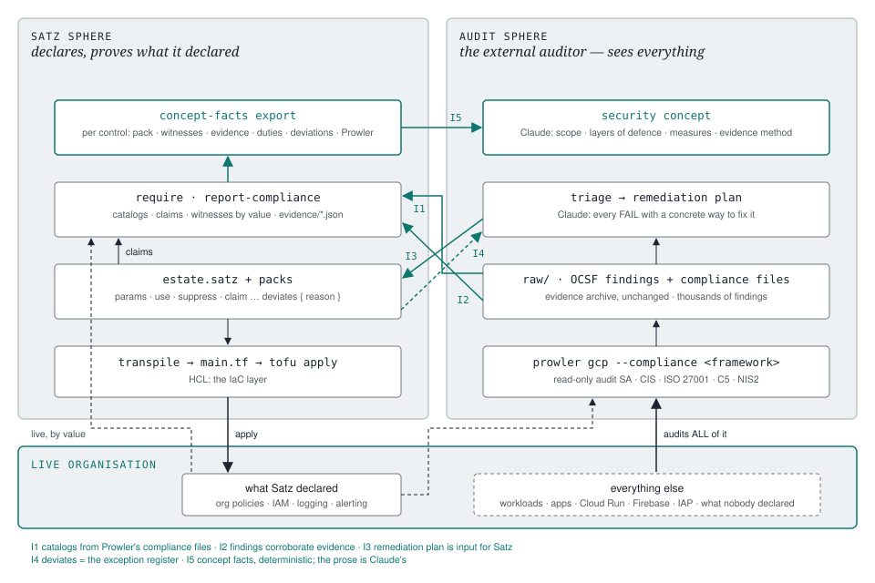

# The security toolset in the Satz sphere — a proposal

**Status:** proposal, 2026-08-25. Owner decisions already taken: satz exports
*facts*, Claude writes the *prose*; the document lives here, name-free, with a
drawn diagram. Companion to `satz-language.md`, which it does not change.

This document answers one question: **where does an external audit toolset —
Prowler scanning a whole organisation, Claude turning findings into a
remediation plan and a security concept — plug into a language whose whole
point is to prove what it declared?** The answer is five integration points,
each a small, deterministic surface on satz, and a division of labour that
keeps the auditor independent of the thing it audits.

---

## 1. Two spheres, one organisation



Satz and the toolset look at the same organisation from opposite sides.

| | Satz sphere | Audit sphere |
|---|---|---|
| question | *is what we declared live and enforcing?* | *is the whole organisation conformant?* |
| scope | what an estate declares — org policies, IAM, groups, logging, alerting | **everything**: every project, every workload, every resource nobody declared |
| method | claims name emitted addresses; evidence checks them by value | Prowler runs the framework's checks against live config APIs |
| output | goal view (✓ ◐ ⚠ ✗ ‼), evidence report, evidence history | OCSF findings, compliance CSV per framework, HTML |
| stance | first party — proves its own claims | **third party** — the external auditor; owes Satz nothing |

The asymmetry is the design. Satz can only prove what it knows about, and a
`verified` row means exactly "the witness I named is live and doing what I
declared" — it says nothing about the Cloud Run service somebody deployed by
hand last week. Prowler sees that service. It also sees the org policy Satz
declared and reports it PASS, which is a genuinely independent second
confirmation from a system that read the API on its own.

So the loop is not "Satz checks itself". It is: **the concept says what should
be; Satz declares and proves it; the auditor measures everything; findings that
Satz could have prevented become packs; findings Satz cannot express become the
concept's own-controls section.** Every turn of that loop leaves the fleet with
one more thing that is excluded by default.

### What exists today (audited 2026-08-24, `src/compliance.rs`)

Honesty first, because the proposal builds on this and some of it is thinner
than the README suggests.

| surface | state |
|---|---|
| `report-compliance --prowler <file>` | reads Prowler's **legacy native JSON** only: top-level `status` and `compliance`. Prowler ≥ 4 emits OCSF, where those are `status_code` and `unmapped.compliance` — the parser finds nothing and, by its own "corroboration must never fail the report" contract, silently yields `–` in every row. Counts PASS/FAIL per CIS id; reads no severity, resource, title or remediation. No test covers it. |
| catalogs (`presets/catalogs/*.yaml`) | three keys per control — `title`, `paraphrase`, `automatability`. No Prowler check id, no cross-framework column. `cis-gcp-5.0` is a provisional §2 subset. No second framework anywhere in the repo. |
| `require` | text only, no JSON. Its "Provides: `<pack>`" hint comes from indexing every claim in the preset library by control id — a real control→pack map, but pack-name only. |
| claims at the compliance boundary | `claims_from_frontend` drops pack **version, file and line**; `interpretation` and duty text are parsed but never rendered. |
| `evidence/<framework>-<ts>.json` | one row per control; `witnesses`, `duties`, `prowler` are **pre-rendered markdown strings**, not structured data. |
| live matching | six resource types (org sink, log metric, bucket, alert policy, notification channel, org policy) at org scope; address → live id only, never the reverse; no project scoping. |
| the toolset's own footprint | `presets/security-audit/sa-security-audit.satz` provisions the read-only audit service account and its impersonation group — the auditor is itself a pack. Metric filters in the alerting packs are already written to Prowler's substring expectations. |

Two consequences shape the proposal. First, the evidence side needs an OCSF
parser before anything else is meaningful. Second, the data the concept needs —
pack version, source line, interpretation, duty text, structured live state —
is *already parsed* and merely thrown away at one function boundary. Most of
I5 is "stop dropping it".

---

## 2. The five integration points

Numbered as in the diagram. Each one says what it is, why it goes there, what
changes in satz, and what stays on the toolset side.

### I1 — Catalogs come from Prowler's compliance files

**What.** `satz catalog import <prowler-compliance.json>` writes
`presets/catalogs/<framework>.yaml` from Prowler's own compliance definition
(`prowler/compliance/gcp/cis_5.0_gcp.json` and siblings): every requirement id,
its section, and — new — the **Prowler check ids** that measure it.

```yaml
catalog: cis-gcp
version: "5.0"
source: prowler/compliance/gcp/cis_5.0_gcp.json @ <prowler version>
controls:
  "2.3":
    title: "Retention on the log bucket"
    paraphrase: "…ours, as today…"
    automatability: partial
    checks: [cloudstorage_bucket_log_retention_policy_lock]
```

**Why here.** The toolset note's own conclusion was "do not rebuild Prowler":
its compliance JSON is the best available machine-readable statement of *which
check measures which requirement*. Today the two catalogs were typed by hand
and `cis-gcp-5.0` is flagged provisional for exactly that reason. Importing
also brings the frameworks the toolset already lists — ISO/IEC 27001:2022,
BSI C5, NIS2 — for free: Prowler ships their mappings, so `require iso-27001-2022
<estate>` becomes possible the day the catalog exists, *with the same claims*,
because a claim names a control id and the import tells us which control ids
the same check serves.

**What changes.** A `checks:` list and a `source:` line in the catalog schema
(`Control` gains `checks: Vec<String>`); the import command; paraphrases stay
ours and are preserved across re-imports (framework prose is
licence-restricted and never copied). A `derived-from` cross-reference so a
control can say it is the ISO face of a CIS control.

**Stays on the toolset side.** Choosing frameworks per scope, Level 1/2
selection, the MANUAL-control sampling.

### I2 — Findings corroborate the evidence report (fix, then extend)

*Status 2026-08-29: the fix and the CONTESTED / unmanaged / MANUAL verdicts shipped (v0.46.33); the triage buckets of I3 and the accepted-exception join of I4 are still proposals.*

**What.** Parse OCSF: `status_code`, `severity`, `finding_info.{uid,title}`,
`unmapped.compliance`, `unmapped.check_id`, `resources[].{uid,name,type}`,
`cloud.project.uid`, `remediation.desc`. Match a finding to a catalog control
**by check id** (I1), falling back to the compliance list. Then join with the
evidence row and state a combined verdict:

| Satz says | Prowler says | verdict |
|---|---|---|
| verified | PASS | **verified, corroborated** — two systems, one answer |
| verified | FAIL on the *same* resource | **CONTESTED** — outranks verified; somebody is wrong and the report says so |
| verified | FAIL on a *different* resource (another project) | verified, **plus an unmanaged finding** — Satz's witness is fine; something outside the estate is not |
| NOT ENFORCED / DRIFTED | FAIL | confirmed |
| deviation (accepted) | FAIL | **accepted exception** — see I4 |
| unmet | FAIL | unmet, with the resources Prowler saw |
| any | MANUAL | duty; surfaces in the duties column |

**Why here.** The evidence report is already the place where declared meets
live. A second, independent reader of the same organisation belongs in the
same row — and the CONTESTED verdict is the single most valuable thing an
external auditor can give a first-party proof system: it catches the case where
`verified` is true and insufficient.

**What changes.** `ingest_prowler` rewritten for OCSF with a fixture test (the
legacy shape can stay as a fallback). Findings kept per resource, not as
counts. `evidence/*.json` rows gain a structured `prowler: [{check, status,
severity, resource, project}]` and `verdict`. The report's Prowler column shows
`3 PASS / 1 FAIL · CONTESTED` instead of `–`.

### I3 — The remediation plan is input for Satz: triage

*Status 2026-08-29: shipped as `satz triage` (v0.46.34) — buckets A–E as below, markdown and JSON; bucket B uses a suffix reverse index from the finding's resource uid to the declaring block; the param link of bucket A waits for I5.*

**What.** `satz triage <framework> <estate> --prowler <ocsf.json>` sorts
every FAIL into the bucket that says *who fixes it and how*:

| bucket | test | plan skeleton says |
|---|---|---|
| **A · a pack already covers it** | the control is unmet and the library index has a provider | "adopt `<pack>` (v`<n>`)" — or, if the pack is included and the control is still FAIL, "set param `<p>`" (once I5 links controls to params) |
| **B · Satz declares the resource** | the finding's resource matches an emitted address (needs the reverse index, see §4) | "the estate declares this at `<file>:<line>`; witness is `<state>`" — usually a CONTESTED case from I2 |
| **C · declared exception** | a `deviates` claim covers the control | "accepted: `<reason>`; open duties: `<…>`" — nothing to fix, something to re-assess |
| **D · unmanaged, expressible** | the resource type has a provider schema entry and a scope Satz can hold | "bring under management: declare or `import-id` in `<estate>`, or generalise into a pack" |
| **E · not IaC** | MANUAL controls, console-only settings, Workspace, things `gcloud` cannot read | "manual: `<audit procedure>`" — stays a duty |

Output is markdown and JSON: one section per bucket, each finding with its
control, resources, severity, and Prowler's own remediation text. **That is the
skeleton of the remediation plan.** Claude adds what a skeleton cannot: the
concrete `gcloud`/Satz snippet, ordering, side effects, and the customer's
constraints — the toolset's "no finding without a way to fix it" rule, with the
*which way* pre-sorted.

**Why here.** This is the arrow the whole loop turns on. Bucket A is the
findings→presets generalisation the toolset already practises by hand; bucket D
is the pipeline for new packs; bucket B keeps first-party proof honest; bucket C
means an exception is a *record*, not a recurring argument.

**What changes.** A command that composes three things satz has —
the library claim index, the compile's address set, the `deviates` claims —
with the I2 findings. Buckets A, C, E need nothing new; B needs the reverse
index (§4); the param link in A is I5's `governs`.

### I4 — `deviates` is the exception register

*Status 2026-08-29: the join shipped (v0.46.34) — a FAIL on a deviated control renders as **accepted exception — <reason>** in the Prowler column and lands in triage bucket C. `--review` (audit-side false positives) is still a proposal.*

**What.** Nothing new in the language. A `claim … deviates { reason = "…" }` is
already the only way an estate can decline a control on the record, with a
mandatory reason and optional duties. I2 makes Prowler findings *resolve
against it*: a FAIL whose control is covered by a deviation renders as
**accepted exception — `<reason>`**, and the toolset's status taxonomy gets a
row it did not have: the FAIL is real, known, and justified in the estate that
owns the resource.

**What stays audit-side.** The **FALSE POSITIVE** category (Prowler's CIS 2.1
check that cannot see inherited audit configs; the version without org-sink
support). Those are statements about the *tool*, not about the estate, so they
do not belong in Satz. They live in the audit workspace as
`findings-review.yaml` (`check_id`, `resource`, `verdict: false-positive`,
`evidence`, `by`, `date`) and can be passed to `triage` and `report-compliance`
as `--review`, which annotates but never suppresses: the report still shows
the FAIL, marked *reviewed: false positive — <evidence>*. Satz never mutes
evidence on its own authority.

And the **deviation is STALE** verdict already exists: a fork that declines a
control the live policy actually enforces is caught. Prowler PASS on a
deviated control is the same signal from the other side.

### I5 — Concept facts, deterministic; the concept, Claude's

**What.** `satz concept-facts <framework> <estate> [--prowler <ocsf>]
[--format json|md]` exports everything a security concept needs that is a
*fact about the estate*, per control and per layer:

```json
{
  "estate": "acme", "framework": "cis-gcp", "version": "4.0",
  "compiled_at": "…", "verified_at": "…",
  "controls": [{
    "id": "1.4", "title": "…", "paraphrase": "…", "automatability": "technical",
    "goal": "satisfied", "evidence": "verified", "verdict": "verified, corroborated",
    "coverage": "implements",
    "packs": [{"name": "CIS_GCP_Foundation_4_0", "version": "2.1", "file": "presets/…", "line": 321, "pristine": true}],
    "interpretation": "User-managed service account keys can neither be created nor uploaded org-wide…",
    "witnesses": [{"address": "google_org_policy_policy.iam_managed_disableServiceAccountKeyCreation",
                   "live": "organizations/…/policies/iam.managed.disableServiceAccountKeyCreation",
                   "state": "verified", "enforce": "TRUE"}],
    "governs": ["allowed_policy_member_subjects"],
    "duties": [{"id": "rotate-existing", "text": "…", "attested": null}],
    "deviation": null,
    "prowler": [{"check": "iam_sa_no_user_managed_keys", "status": "PASS", "resources": 14}]
  }],
  "layers": {
    "identity":   {"packs": ["s1-group-definitions@1.1", "s1-group-permissions@1.0"], "groups": 9, "memberships": "human-owned"},
    "preventive": {"packs": ["CIS_GCP_Foundation_4_0@2.1"], "org_policies": 18, "enforced": 17, "deviations": 1},
    "detective":  {"packs": ["organization-audit-logsink@1.1", "organization-cis-log-alerts-central@1.0"],
                   "sinks": 2, "metrics": 8, "alert_policies": 8, "scc": "premium (not codeable, see #27)"},
    "assurance":  {"claims": 23, "evidence_runs": 4, "last": "…", "audit_sa": "sa-security-audit@1.0"}
  },
  "estate": {"folders": 4, "projects": 12, "suppressions": [{"type": "…", "label": "…"}],
             "hcl_passthrough": [{"file": "…", "line": 14, "trusted": "reviewed …"}],
             "unmanaged_findings": 37}
}
```

**Why here.** The concept's hardest section — *layers of defence and the
measures taken* — is, for the platform part, a rendering of facts Satz already
holds: which packs, which policies enforced, which deviations with which
reasons, which duties open, what the last evidence run said. Today those facts
are scattered across three commands' text output and one JSON of rendered
strings. The export puts them in one place, structured, and the skill
`konzept-erstellen` merges it with the scope interview and the application-side
methodology (four phases; evidence on file:line or "outstanding" plus a check
command; never an invented control id; the assumptions register for
tenant-admin-owned controls) into the document. Claude writes the
Schutzbedarfsfeststellung, the responsibilities, the own-controls section for
what CIS does not cover — Satz does not know those, and should not pretend to.

**What changes.**
- Keep pack version/file/line through `claims_from_frontend`; render
  `interpretation` and duty text (they are dead code today).
- `require --format json` and structured evidence rows (per-witness live state
  instead of one markdown string) — I2 needs the same thing.
- A `governs = [param, …]` entry on a claim, so a control can name the params
  that tune it. Optional; today's claims stay valid. This is also what bucket A
  of triage needs to say "set param p" rather than "adopt pack P".
- The `layers` grouping is a **catalog-side tag**, not language: each pack
  declares `layer identity|preventive|detective|assurance` in its header, or
  the catalog maps control sections to layers. Pack header is cleaner and
  survives forks.

**What stays with Claude.** Everything that is a judgement: scope, protection
needs, risk, responsibilities, the prose, the app-side analysis, and the
decision what to present as a layer. The export is the evidence appendix and
the skeleton of the "measures" chapter; the concept is the document.

---

## 3. Division of labour

| step | who | reads | writes |
|---|---|---|---|
| define the target (concept) | Claude + human | scope interview, concept-facts (I5), METHODIK phases | concept `.docx` |
| roll out | satz + human runs `tofu` | estate + packs | `main.tf`, live org |
| prove first-party | satz | claims, Cloud Asset Inventory | goal view, evidence report + history |
| audit third-party | Prowler (read-only audit SA, a pack) | the whole org | OCSF, compliance CSV |
| corroborate | satz (I2) | OCSF + evidence | combined verdicts, CONTESTED |
| triage | satz (I3) | OCSF + library index + addresses + deviations | plan skeleton A–E |
| plan | Claude | skeleton, customer constraints | remediation plan with `gcloud`/Satz snippets |
| **execute** | **customer / operations — never Claude, never the toolset** | plan | changes |
| generalise | human + Claude | bucket A/D findings | new or updated packs |
| except | estate owner | reason | `claim … deviates` (I4) |
| review false positives | auditor | tool behaviour | `findings-review.yaml`, audit-side |
| re-audit | Prowler; satz `delta` | two OCSF runs | delta; evidence history |

Three lines are load-bearing. *Execute* stays human: the toolset's credentials
are read-only and Satz's `apply` is the owner's command — nothing in this
proposal gives Claude a write path. *Except* is in the estate, not in the audit
workspace, because an exception is a decision about the resource's owner's
risk, and the estate is where that owner writes. *Review false positives* is
the one bucket that is about the tool, and it stays out of Satz so that Satz
can never be accused of muting its own auditor.

---

## 4. Scope model: what Satz covers, what it cannot yet

The toolset's three scope types map onto Satz unevenly, and the concept must
say so per scope rather than paper over it.

| scope | Satz covers today | Prowler sees additionally | concept section |
|---|---|---|---|
| **platform only** | org structure, IAM/groups, org policies, org-level logging and alerting, essential contacts, budgets, the audit SA | project-level drift, hand-made resources, SCC findings, everything MANUAL | the platform chapter is mostly I5 facts + open duties |
| **full org** | as above, for every project the estate declares | every workload in every project | platform chapter as above **plus** an unmanaged-inventory appendix from bucket D/E |
| **one application + its infrastructure** | the platform controls the app inherits; the app's projects if declared | the app itself: Cloud Run, Functions, Firebase/Firestore, IAP, Identity Platform, secrets, CI/CD — **CIS barely covers these** and Satz has no packs for them yet | inherited controls from I5; the app-side analysis (ten analyses, H/M/W findings) is the toolset's methodology and is not a Satz concern; the own-controls section closes what CIS does not cover |

Two things follow for the roadmap:

- **Workload packs** are the way bucket D findings stop recurring: a Cloud Run
  hardening pack, a Firestore rules baseline, an IAP-in-front pattern — each
  with claims against whichever framework has a control for it, and against an
  **own catalog** (`presets/catalogs/workload-baseline.yaml`) where none does.
  The catalog format carries that already; only the packs are missing.
- **The reverse index** (live resource → declaring address) is the piece bucket
  B needs and the codebase lacks. It is not discovery reborn: the compile
  already knows every emitted address and, for the six matched types, the live
  id it resolved to. Keeping that map (address ↔ live id ↔ project) from
  `report-compliance` and reading it in `triage` is enough for the platform
  scope; extending live matching beyond six types is the same work the evidence
  report needs anyway.

---

## 5. Sequence

Small, in dependency order, each one useful alone. Numbers are task ids.

| # | work | size | unblocks |
|---|---|---|---|
| **#35** | OCSF parser for `--prowler` with a fixture test; per-resource findings; check-id matching with compliance-list fallback | S | I2, I3 |
| **#36** | `catalog import` from Prowler compliance JSON; `checks:` + `source:` in the schema; re-import preserves paraphrases; first ISO 27001:2022 catalog as the proof | M | I1, cross-framework `require` |
| **#37** | keep pack version/file/line through the compliance boundary; render interpretation + duties; `require --format json`; structured evidence rows | S–M | I5, I2 verdicts, I3 bucket B |
| **#38** | combined verdicts in `report-compliance` (corroborated / CONTESTED / accepted exception / unmanaged); `--review findings-review.yaml` annotation | M | I2, I4 |
| **#39** | `triage` command, buckets A–E, md + json; reverse index kept from the evidence run | M | I3 |
| **#40** | `concept-facts` export; `governs` on claims; `layer` in pack headers; skill contract for `konzept-erstellen` | M | I5 |
| later | workload packs + own catalog; `delta` over two OCSF runs; extend live matching beyond six types | L | scope type 3 |

#35 and #37 are worth doing first regardless of the rest: the first makes the
existing `--prowler` flag true to its README, the second stops throwing away
data that is already parsed.

---

## 6. Boundaries that do not move

- **Read-only audit.** The audit SA is `viewer` + `securityReviewer` +
  `securitycenter.adminViewer` + `cloudasset.viewer`, impersonated; no keys.
  The pack that provisions it ships with satz; the toolset never gets more.
- **Remediation is executed by the customer or operations.** satz emits,
  the owner applies; the toolset plans. No path in this proposal changes that.
- **Satz never mutes evidence.** A FAIL is shown even when a deviation covers
  it or a review calls it a false positive — annotated, never hidden.
- **Check semantics, not conformity.** Corroborated or not, the report states
  "a resource with these properties was verified at this time". The concept is
  where a human states what that means.
- **No names.** This document, the export, the catalogs and every example are
  free of customer identifiers; the repo is public, and the concept documents
  that carry names are produced in the audit workspace, not here.
