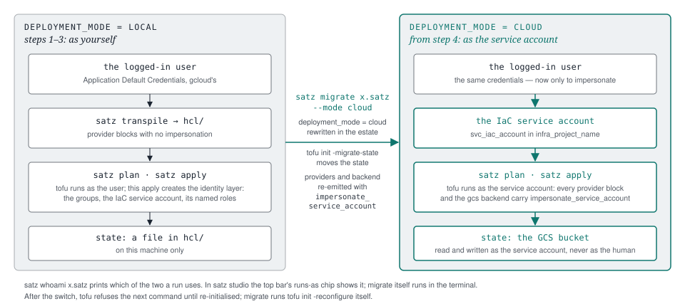

# satz workflows

Three walkthroughs, in the order most estates meet them, each a section of this page,
and after them two shorter ones: [continuous verification](#continuous-verification),
the compile check and the compliance report run as CI gates, and
[scanning with Prowler](#scanning-with-prowler), the second opinion satz joins with its
own report. Every command has its own reference section in
[the README](../README.md#cli-usage); this page is the order to run them in.

**[From nothing to applied](#from-nothing-to-applied).** The estate is written, the
folder, management project and state bucket are bootstrapped, the identity layer is
applied as the logged-in user, the state and the identity move to the IaC service
account, and only then packs go in, one at a time. Its prerequisites section describes
the fresh-organisation case — a super admin creating the identity layer, an
Organization Administrator on the organisation — because a new organisation has one
principal, the super admin who created it, and Google grants that principal
Organization Administrator. That is the strongest case, not what satz needs in
general; the last paragraph below says what it needs.

**[Adopting an organisation that already exists](#adopting-an-organisation-that-already-exists).**
Folders, projects, groups and policies are already live. `satz import` discovers them
into an estate from a state file or from the organisation itself, the hierarchy is
refined by hand, `satz transpile` and `tofu plan` hold the result against what is
live, and `satz adopt` resolves the ids of what exists so the plan reads no changes
rather than replace. Once it does, the infrastructure is changed through the estate
from then on; nothing is recreated on the way.

**[Keeping presets current](#keeping-presets-current).** The loop that runs for the
life of an estate. `check-presets` reports which packs are behind upstream, edited
locally or changed only in what they ask; `get-presets` installs what is missing and
refreshes what the estate does not use; `merge-presets` reconciles the rest — a pack
behind upstream is refreshed, one you edited becomes an `X.local.satz` fork with the
delta beside it in `X.diff.satz`, and the estate is repointed. The filename suffix says
who owns each file.

**satz studio** is the desktop app beside satz. It drives the same binary and the same
estate files, so every step below can be taken either way, and the diagrams show both:
the commands in the terminal, and the views in the app. What the app does not run itself
— `bootstrap` and `apply`, which create as the human and ask for approval — it hands to
the terminal as a command line to copy.

**What satz needs, and where.** satz owns no credential: it runs as the logged-in
user's Application Default Credentials until the switch to the service account, and as
that account afterwards. Before `bootstrap` creates anything it tests the permissions it
needs on the *scope root* — the organisation, or a folder — and on the billing account,
and names what is missing. With a folder as the scope root
(`customer_organization_id = "folders/<id>"`) the estate installs under that folder: the
permissions are tested there, organisation-root operations are skipped, and an operator
granted on the folder is not asked for organisation admin. What satz needs is the right
to do its work where its root is — create the folder and the project, link billing —
and nothing above it. The one exception is Google's: `roles/orgpolicy.policyAdmin` is
granted at organisation level only, so an estate that declares org policies on its
folder needs that grant from an organisation administrator before its first apply. The
details, including what bootstrap self-grants and when it stops instead, are under
[Bootstrap the organisation](#bootstrap-the-organisation).

---

## From nothing to applied

Five steps, in this order. Each one is a section below.

1. **Write the estate** — `satz init` with the day-0 values, or `satz interview
   … --create` to be asked for them one at a time. Either way the file carries the same
   commented pack menu, so a pack is added by uncommenting its line, by answering its
   question, or by `satz merge-presets` writing the line for a pack the library gained
   since. The menu is written from `presets/pack-graph.json`, the pack graph that ships
   with the presets; with no graph in `presets_dir` the file is written without pack
   lines, and `satz get-presets` then `satz merge-presets` write the whole menu where it
   goes. A pack scoped to a block — the audit logsink and the CIS log alerts to the
   infrastructure folder, essential contacts to its own resource map — has its line
   written inside that block, where its resources belong. A pack that reads a param of
   one of those two logging packs — Sentinel, which defaults its project to the
   logsink's, its two log paths, and the findings mail, which defaults its mailbox to the
   central alerts' — has its line written after the folder, because a param is known
   from the line that declares it on.
2. **Bootstrap the organisation** — `satz bootstrap`, which creates the folder, the
   management project, the billing link, the foundation APIs and the state bucket, then
   transpiles and imports what it made.
3. **Apply as yourself** — `satz transpile`, then `plan` and `apply`. This is still
   `deployment_mode = "local"`: the run authenticates as the logged-in user's
   Application Default Credentials, and it creates the identity layer — the groups, the
   IaC service account and its roles.
4. **Switch to the service account** — `satz migrate … --mode cloud`, which moves the
   state into the bucket and makes every later command impersonate the IaC service
   account. From here nothing runs as a human.
5. **Then add packs** — the CIS baseline and whatever else the estate needs, one at a
   time, each with its own plan and apply. Presets come *after* step 4: the
   day-0 scaffold has to exist and the state has to be in the bucket before a pack
   creates anything on top of it. [Keeping presets current](#keeping-presets-current)
   is that loop.

   An estate the interview wrote already lists every pack, each as a commented `use` line
   under the phase it can be adopted in — the map first, then the security-group model,
   then what depends on the groups, and so on. `satz add-pack <estate> <gate>` adds a pack:
   it binds the gate, makes the line active, and refuses while a pack it needs is off,
   naming it; `satz remove-pack` binds the gate false. Answering that pack's question in
   `satz interview` switches its line on the same way, and `satz packs` shows every pack
   with its answer, its line and what it needs. `satz merge-presets` writes the
   line for a pack the library has gained since the estate was written, so the list stays
   the library's rather than one person's memory of it. A question **this estate** has
   answered `true` whose line is still commented — or missing — is reported at every
   compile, because otherwise the answer is bound and nothing emits it. The answer is the
   estate's own `params {}` binding: a default in the map or in a pack is the library's
   proposal, so a day-0 skeleton — every line commented, nothing answered — compiles clean
   at `validation_level = "error"`, and `satz packs` is where the proposals are read.

   A pack can name one command to run once it is on: the CIS org-policy packs name
   `satz adopt <estate> --execute --import`, because Google sets some of their policies on
   every new organisation and an apply that creates a policy that exists stops on `409
   POLICY_ALREADY_EXISTS`. satz prints that notice when the pack goes on, the compile warns
   at its `use` line, and `transpile --apply` and `bootstrap` refuse until the estate binds
   the notice's param `true` — which `adopt --execute --import` does itself when the run
   covers every type and nothing is left unresolved.


### Prerequisites

The executing user needs:

- **Superadmin** access to the Google Workspace / Cloud Identity account.
- **Organization Administrator** on the Google Cloud organization.
- **Billing Account Administrator** on the target billing account (granted in the
  reseller console).

Authenticate, then write the estate and the folder structure around it:

```bash
gcloud auth application-default login

satz init \
  --customer-id "C01234567" \
  --customer-shortname "example-org" \
  --billing-account-infra "A12345-B67890-C12345" \
  --customer-domain "example.com" \
  --customer-organization-id "123456789012" \
  --iac-user "admin@example.com"
```

**Without the flags**, `satz interview yaml/<name>.satz --create` writes the estate and
asks for the
same seventeen values one question at a time, offering the derived ones as defaults; an
agent does the same over MCP. Both end at the file `init` would have written, and
[satz interview](interview.md) describes the rules they share: an answer is a param the
estate binds, and nothing below runs while one is missing.

### Bootstrap the organisation

`bootstrap` refuses while any question the estate's packs declare is unanswered, and
while a pack's `severity = error` notice is unacknowledged; `--dry-run` compiles, prints it and goes on.

Before it asks for a credential, `bootstrap` checks the params it is about to use:
`customer_shortname`, `billing_account_infra`, `infra_project_name` and
`infra_bucket_name` are present — each is the estate's own value, and the only default
is the one `estate-core` declares — the organisation id is
a number, the billing account reads `XXXXXX-XXXXXX-XXXXXX`, and the project id and
bucket name are shaped the way Google accepts them. A failure names the param and the
flag that sets it, and nothing is called — an empty value used to travel into a URL
and come back as an HTML error page. Then, before any permission is tested, the
organisation itself is resolved: one that is not visible to the caller is reported as
that, with the ones that are listed, rather than as a wall of missing permissions.
Where the estate binds `customer_id` as well, the two are cross-checked, so an
organisation belonging to a different directory customer is named before anything is
created. The state bucket is created in `default_region`; an estate that binds none
gets `europe-west3`, the default `presets/estate-core.satz` declares, and bootstrap
prints the line `default_region not set — using europe-west3, the documented default`.

`bootstrap` creates the day-0 infrastructure — the infrastructure folder, the
management project, the billing link, the foundation APIs (which `tofu` needs
enabled before its first run) and the state bucket — then runs `transpile`, `init` and
the first imports, so what it created is under management from the start.

```bash
satz bootstrap C0example.satz
```

**Pre-flight.** Before anything is created, bootstrap verifies the ADC identity
against `first_admin` and tests the required PERMISSIONS — never roles — with
`testIamPermissions`:

| Where | Permission | Supplied by |
|---|---|---|
| scope root | `resourcemanager.folders.create` (only when `infra_folder_name` is set) | `roles/resourcemanager.folderAdmin` |
| scope root | `resourcemanager.projects.create` | `roles/resourcemanager.projectCreator` |
| scope root | `orgpolicy.policies.create` (the estate's policies, at first apply) | `roles/orgpolicy.policyAdmin` |
| billing account | `billing.resourceAssociations.create` | `roles/billing.user` |

- Everything granted → bootstrap proceeds.
- Something missing and the caller holds `setIamPolicy` on the scope root — the
  normal state of a fresh organization, whose creating super admin is auto-granted
  Organization Administrator (that role carries `setIamPolicy` but none of the
  create permissions) → bootstrap **self-grants** the missing roles to the caller,
  prints each grant with the exact `remove-iam-policy-binding` undo command, waits
  for IAM propagation and re-tests before proceeding.
- Something missing and no `setIamPolicy` (or the billing permission, which is
  never self-granted) → bootstrap prints the exact
  `gcloud … add-iam-policy-binding` commands for an administrator and stops
  **before creating anything**.

**Folder-scoped installs.** Set `customer_organization_id = "folders/<id>"` and the
estate installs under that folder: permissions are tested there, and org-root
operations are skipped, so an operator granted on the folder is not asked for
organization admin. Google grants `roles/orgpolicy.policyAdmin` only at organization
level: on a folder scope a missing `orgpolicy.policies.create` is reported as
advisory, and folder-level org policies need an organization-level grant before
their first apply.

**Dry run.** `satz bootstrap <estate> --dry-run` is read-only: it prints the plan,
verifies the identity and runs the same pre-flight (a would-be self-grant is
reported, not executed). Without credentials the plan still prints and the skipped
pre-flight is named (`pre-flight: SKIPPED`).

**What bootstrap does NOT do:** it creates no service account and grants no IAM
beyond the self-grant above — the IaC service account and its grants are declared in
the estate and come into being on the first `tofu apply`.

**What follows.** `bootstrap` ends by naming the next commands with the estate's own
values, in this order: `satz update-prerequisites <estate>`; `satz transpile <estate>
--plan`, then `--apply`, as you in local mode, which creates the groups, the IaC service
account and its roles; `satz migrate <estate> --mode cloud`, which moves the state into
the bucket and assigns the service account **Groups Admin** — a Workspace role, not an IAM
grant — through the Admin SDK when your login carries the role-management scope, and
otherwise says what is missing and names the admin-console path; and `satz whoami
<estate>` followed by a plan that must read "No changes". `migrate`, `get-presets` and `adopt
--execute` end with their next command the same way.

**Credential line.** Every live command prints one line before its first API call —
`credentials: <identity> (user ADC | impersonated service account | service account
key), quota project <p>` — so a wrong per-customer login shows before the first call
instead of as a later 403. `satz whoami` is the explicit check (`--offline` for
the file-only view; a user ADC file stores no identity, so the online form resolves
it via token introspection). `satz whoami <estate>` answers the other question — the
identity that estate's live commands actually run as. On a cloud-mode estate that is its
IaC service account, and the line names the relation: `runs as: svc-iac-…@… —
impersonated by you@…`. A local-mode estate — the state after `bootstrap`, because the
first apply creates the account — runs as you, and the line names the account it
declares and the command that switches to it: `runs as: you@… — local mode; satz
migrate <estate> --mode cloud makes every run impersonate svc-iac-…@…`. Without an
estate the line says none was given. Both halves print together, because a live
command uses both, and online it CHECKS them: one `generateAccessToken` (token
discarded) for whether this credential may become that account, and one
`projects.get` for whether the quota project is reachable. Given an estate that
compiles, it also tests the permissions the estate's resource types need
(`testIamPermissions` on the organization, the infra project and the billing account)
and names each missing one with the role that carries it. `--offline` reads the
estate file alone and says the checks were not made rather than implying they
passed.

**Quota project.** Set the ADC's quota project to a project the caller can reach,
normally the infra project:

```bash
gcloud auth application-default set-quota-project <infra_project_name>
```

A quota project the caller cannot see — for example a typo — does not work: commands
that only print it accept it, and every API call then fails with `UserProjectInvalid`,
or `report-compliance` with "live inventory unavailable". Live commands check it once
before the work and refuse with the project named.

**Impersonation.** On a `deployment_mode = "cloud"` estate, every live command
impersonates the estate's IaC service account
(`{svc_iac_account}@{infra_project_name}.iam.gserviceaccount.com`) — exactly the
identity `tofu` applies with — so the human needs no org-wide read roles, only
`roles/iam.serviceAccountTokenCreator` on the SA (normally via membership in
`svc-iac-users`). `--no-impersonate` opts out; `bootstrap` never impersonates (day
0, the SA may not exist yet); an ADC that already impersonates is used as-is. The
credential line names the SA the calls actually run as. An estate whose params do
not parse, whose `deployment_mode` is neither `local` nor `cloud`, or whose cloud mode
has no value for `svc_iac_account` or `infra_project_name`, names no identity: `whoami`, `migrate` and every live command refuse it with the reason, and
none runs as the logged-in user instead.

**Greenfield: a tenant with no organization yet.** Google creates the Organization
resource for a Workspace/Cloud Identity domain when a NEW Google Cloud user signs in
to the console and accepts the terms, or when an EXISTING user creates their first
project or billing account
([documented](https://docs.cloud.google.com/resource-manager/docs/creating-managing-organization)).
A customer new to Google Cloud whose admin has signed in to the console and accepted
the terms therefore already has an organization: `satz init` derives its id, and plain
`satz bootstrap` is the path. `--greenfield` is for a tenant where nobody has signed in
yet, and uses the second trigger:

1. `satz init --customer-id <C0…>` — derives every derivable init value
   from the ADC alone (identity → `first_admin` + `customer_domain`,
   `organizations:search` → org id + directory customer id,
   `billingAccounts.list` → the single open account; explicit flags always win,
   nothing is guessed). With no organization visible, the estate is written with an
   empty `customer_organization_id`.
2. `satz bootstrap <estate> --greenfield` — creates the infra project WITHOUT a
   parent (the trigger), polls `organizations:search` until the new organization
   appears (matched by its `directoryCustomerId`, never "the first org"), moves the
   project under it, writes the id back into the estate, and continues with the
   normal pre-flight and build. If the organization never appears (the ADC user has
   not accepted the console terms), the timeout names the one-time console sign-in
   as the fallback.

An estate whose `customer_organization_id` is empty fails with exactly this guidance
instead of a bare "missing org id".

### Transpile, plan, apply

Bootstrap already transpiled and initialised. After any later edit to the estate,
compile it again and read the plan:

```bash
satz transpile C0example.satz

cd hcl/
tofu plan
tofu apply
```

The first apply creates the identity layer: the Cloud Identity groups, their IAM roles
(`Token Creator` among them) and the rest of the management project.

`tofu` applies `hcl/` as satz wrote it, with one exception that needs an argument: an
org policy the state holds with rules while the estate declares it `reset = true`. The
API refuses to switch such a policy to reset in place (`400 Cannot set PolicyRules if
reset is true`), so the apply has to replace it. `satz plan` and `satz apply` add the
`-replace`; for an apply that does not run through satz, `main.tf` names it in a comment
above each policy it declares reset:

```hcl
# Declared reset: while the state holds its rules, the API refuses the in-place update (Cannot set PolicyRules if reset is true).
# satz plan and satz apply add the replace; a bare apply needs: tofu apply -replace=google_org_policy_policy.iam_disableServiceAccountKeyUpload_superseded
resource "google_org_policy_policy" "iam_disableServiceAccountKeyUpload_superseded" {
```

A policy the state holds without rules, or does not hold yet, needs no `-replace`.

A pack added later can emit a resource type the IaC service account holds no role for.
The compile names the role, and `satz update-prerequisites C0example.satz` writes it into
the estate's grant list. The apply then creates the grant and the resources that need it
in one pass; a resource that meets a permission error on the role just granted is
created by running the apply again once the grant has taken effect, which takes up to a
few minutes.

### The API preflight

Every provider block carries `user_project_override = true` with `billing_project =
<infrastructure project>`, so Google bills every call to that project and wants the API
enabled there. `tofu apply` refreshes every resource in state before it creates
anything, and an API the estate declares as a `google_project_service` but the project
has off stops that refresh — before the declaration that would enable it is created.

`satz plan` and `satz apply` enable them first. They read the emitted `providers.tf`
for the project the default provider bills to and the service account it impersonates,
read `main.tf` for the services declared on that project, ask Service Usage which are
off and switch those on, as the estate's IaC service account — the identity the estate
grants `roles/serviceusage.serviceUsageAdmin`. `satz transpile --plan` and `--apply` do
the same. Nothing to do reads as one line:

```
APIs on corp-infra-001: 14 declared, all enabled
```

and a change names every API:

```
APIs on corp-infra-001: 14 declared, 2 off — enabling them, because the refresh is billed to this project and runs before anything is created
  enabled cloudasset.googleapis.com
  enabled essentialcontacts.googleapis.com
```

The enable is a live change outside tofu's state. The declared
`google_project_service` records an API that is now already on and its create is
idempotent, so the plan that follows shows no change for it.

Where the enable cannot succeed — the identity holds no `serviceusage.services.enable`,
the Service Usage API is itself off on the billed project, an org policy forbids it —
the run stops before `tofu` and prints the command that does it by hand:

```
APIs on corp-infra-001: satz could not enable them: 403 PERMISSION_DENIED …
  cloudasset.googleapis.com
  essentialcontacts.googleapis.com
enable them and run this again:
  gcloud services enable cloudasset.googleapis.com essentialcontacts.googleapis.com --project corp-infra-001
```

`satz --no-api-preflight plan` skips it: satz asks Service Usage nothing and enables
nothing. `update-prerequisites` writes the declaration into the estate and enables
nothing either; it prints the same `gcloud services enable` line for the APIs it adds.
The reasoning is in [ADR 0036](adr/0036-plan-and-apply-enable-the-apis-the-estate-declares.md).

### Switch to the service account, and deploy as it

Steps 1–3 ran as the logged-in user. This is where that ends: the state moves into the
GCS bucket and every later command impersonates the estate's IaC service account.



Switch the state to the GCS bucket and the identity to impersonation:

```bash
satz migrate C0example.satz --mode cloud
```

`migrate` rewrites the estate's `deployment_mode`, switches to service-account
impersonation and runs `tofu init -migrate-state`. An estate without `svc_iac_account`
or `infra_project_name` is refused before the file is touched, naming the param: the
service account is the one those two name. Impersonation applies to both
halves of the run: every provider block gets `impersonate_service_account`, and so
does the `gcs` backend, so the state bucket is read and written as the service
account rather than as the logged-in user.

> When the emitted backend changes, `tofu` refuses the next command until it is
> re-initialised: run `tofu init -reconfigure` once in `hcl/`. `migrate` re-initialises
> by itself.

Then check that the service account can run the plan — this is the first deploy that
authenticates as the service account rather than as a person, which is what the whole
sequence is for:

```bash
cd hcl/
tofu plan
```

A plan that reads *No changes* here means the estate, the state and the organisation
agree, and the estate is ready for its first pack. `satz whoami C0example.satz` prints
the identity the run used, which from now on is the service account, impersonated by the
human who typed the command: `runs as: svc-iac-…@… — impersonated by you@…`.

### The params `init` writes

The same seventeen, each with its question, are `presets/estate-core.satz` — what
`satz interview` asks when there are no flags. An estate `init` wrote binds all of
them and is complete; one the interview wrote is complete when it says so.

| Param | Default | Description |
|-------|---------|-------------|
| `infra_folder_name` | `"Infrastructure"` | Display name for the top-level folder. Leave `""` to create the project in the root. |
| `infra_project_name` | `""` | The unique id for the management (IaC) project. |
| `infra_bucket_name` | `""` | The GCS bucket for Terraform state. |
| `customer_id` | (from CLI) | The Workspace customer id (e.g. `C01234567`). |
| `customer_organization_id` | `"123456789012"` | The numeric Google Cloud organization id. |
| `customer_domain` | `""` | The customer's primary domain (e.g. `example.com`). |
| `first_admin` | (from `--iac-user`) | Local part of the first admin's address; members are built as `user:{first_admin}@{customer_domain}`. |
| `customer_longname` | `""` | The full legal name of the customer entity. |
| `customer_shortname` | `""` | A unique slug for the customer. Names that must be globally unique derive from it. |
| `svc_iac_account` | `"svc-iac-001"` | The primary IaC service account. |
| `svc_iac_users_group` | `"svc-iac-users"` | The Cloud Identity group for IaC administrators. |
| `billing_account_infra` | `""` | The billing account id (e.g. `012345-6789AB-CDEF01`). |
| `deployment_engine` | `"tofu"` | The IaC tool: `tofu` or `terraform`. |
| `deployment_mode` | `"local"` | `local` for day 0 (user ADC); `cloud` for day 1+ (impersonation). Switched by `satz migrate`. |
| `default_region` | `"europe-west3"` | Default region for regional resources. |
| `default_zone` | `"europe-west3-a"` | Default zone for zonal resources. |
| `compliance_frameworks` | `["cis-gcp-5.0"]` | The frameworks this customer is HELD TO, as catalog ids from `presets/catalogs/` (`cis-gcp-4.0`, `cis-gcp-5.0`, `iso27001-2022`) — a contract, an auditor, a regulator. Not what the estate claims, which comes from its packs. A value naming no catalog is refused by the compile. |

---

## Adopting an organisation that already exists

### Discover

Capture what is there. From an existing Terraform/OpenTofu state:

```bash
tofu show -json > state.json
satz import state.json -o migration-discovery.satz
```

Or straight from Google Cloud, with no state at all:

```bash
satz import organizations/123456789012 -o migration-discovery.satz
```

The resource types marked `import: true` in `presets/import-config.yaml` are the
default set. `--all` takes every type the source can deliver instead: from a state
file every row, live every row with an `asset_type`. `--only` narrows either set,
and `--exclude` leaves types out (`--all --exclude "google_*_iam_member"`). The
table is the provider's resource types at its `provider_version` — google and
google-beta, 1280 rows: 449 with their Cloud Asset Inventory name (derived from
the type name, checked against Google's list, `presets/cai-asset-types.txt`, and
asked of ListAssets), 439 that Cloud Asset does not serve as assets (IAM members,
org-policy v1 shapes, the types ListAssets refuses; state shape only), 392 marked
`TODO/UNKNOWN` (Cloud Asset does not inventory them, or the name could not be
derived — `scripts/update_import_config.py` prints what it tried). A copy of the table with your own `import:` flags, passed with
`--import-config`, is the repeatable form. A grant one principal holds on two
folders or two projects is refused, because the map form emits one address per
member and role; `--on-collision counter` writes the second and later as labelled
resources with a running number, and says which.

A live resource whose provider block would not plan is never written: a required
attribute the asset data lacks is derived where it can be (`parent`,
`org_id`/`folder`/`project` from the asset path, a service account's `account_id`
from its email) and the resource is otherwise skipped with the attribute named.
Import ids of live resources are the asset path, with the project named by id (the
provider keeps a project NUMBER on import and the declared id would then force a
replacement). Verified on a test organization with folders, projects, services,
buckets, IAM, org policies, org/folder/project log sinks, a service account and an
essential contact: `tofu plan` = every resource imported, nothing added or
destroyed.

### Refine the estate

The discovered estate compiles as-is and mirrors the live layout in the language's
own forms: projects sit in their folders and resources in their projects, folders are
labelled by display name, grants are member → roles maps with one line per edge,
services are the project's `project_service` list, an org policy is its bare
constraint with a `spec { … }` block, and the organization is referenced as
`customer_organization_id` wherever its number was written. What the platform owns —
the built-in `_Default` and `_Required` log sinks on every container, the grants of
Google's service agents, the legacy bucket grants, Google-created service accounts, a
project that is no longer ACTIVE — is not in the file; the import lists each group
under the `skip:` pattern of the import-config row that took it, and a copy of the
table without that pattern imports it.

The `params` block is the day-0 vocabulary `init` writes, bound from what the
platform states and what the sweep implies: the ADC gives `customer_id`,
`customer_domain`, `first_admin` and a single open billing account; the service
account granted organizationAdmin at the organization gives `svc_iac_account` and
`infra_project_name`, and that project its folder, its versioned bucket and its
billing account; the members give `svc_iac_users_group`; the regional resources give
`default_region`; the leading token of the project and bucket names gives
`customer_shortname`, unless `--customer-shortname` says. A value a rule chose carries
`// inferred:` with the rule and its evidence; a value nothing states is left out and
reported with how to bind it. Every bound literal is referenced wherever the body
repeats it, the way the library spells it, so the estate already speaks the packs'
vocabulary.

What is left is what only a person decides:

- Read the `// inferred:` notes and the "not derivable" lines, and bind what the
  rules could not (`customer_longname` always; `satz interview` asks).
- Replace the policies and grants a pack already carries with the pack's `use` line,
  and bind its params.
- Declare the groups and memberships: they are not in Cloud Asset Inventory, and
  `satz adopt` resolves their ids.
- Look through the skipped list and the numbered grants (`--on-collision counter`),
  and keep or drop them deliberately.

### Reconcile

Generate the HCL and hold it against the live organisation:

```bash
satz transpile migration-discovery.satz
cd hcl/ && tofu plan
```

A plan that says *replace* where it should say *no changes* means the labels or the
resource ids do not line up. Two ways to fix it: declare `"import-id"` in the estate
to bind the existing resource, or `tofu state mv` to move the existing state onto
the new address. `satz adopt` resolves those ids for you where it can — natural-key
lookups for folders, groups, memberships and org policies, `import_id`/`match_on`
rules for the rest — and never guesses: one candidate resolves, several is
ambiguous.

### Hand over to satz

When `tofu plan` shows no changes, or only intended ones, the migration is complete;
from then on the infrastructure is changed through the estate.

The IaC service account reaches the adopted folders and projects, hand-made ones
included, through the roles it holds at the organization: every folder and project
inherits them. `satz update-prerequisites <estate>` writes each role the adopted resource types need
that the estate does not grant it yet into the estate; `--report-only` names them and writes nothing.

---

## Continuous verification

`scripts/fleet-v1.sh` checks, when run, whether every estate compiles on the current
binary. Two Cloud Build triggers check each estate continuously, and also whether the
live organisation matches it:

| trigger | when | runs | fails when |
|---|---|---|---|
| `satz-check` | every push to `main` | `satz transpile --check <estate>` | the estate no longer compiles |
| `satz-compliance` | nightly, Cloud Scheduler | `satz report-compliance <estate> --format markdown --out <file> --fail-on <statuses>` | a witness is DRIFTED or NOT ENFORCED |

Both are one pack:

```
use "presets/ci/verification-runner.satz"
use "presets/ci/verification-runner-grant.satz"
```

The runner is a service account of its own and holds nothing about the estate.
Inside the build, satz's first act is to exchange the runner's identity for the
estate's IaC service account — exactly what it does on a workstation — and the
grant pack is the one IAM binding that permits it. `satz whoami` inside the build
reports the same identities it reports on a workstation.

**Where the runner lives:**

- **Customer-hosted:** `ci_runner_project` is the estate's own infra project; both
  packs in the same estate; nothing to wire, the grant's default names the runner's
  own account.
- **MSP-hosted:** the runner pack in the MSP's estate, the grant pack in the
  customer's, with `ci_runner_service_account` set to the MSP runner's email. No
  credential is shared; one IAM binding grants the access. A Cloud Source Repositories
  trigger can only watch a repository in its own project, so the MSP runner must live in
  the project the estate repositories are hosted in.

**The build steps are inline in the trigger** — there is no `cloudbuild.yaml` in the
estate repository. Whoever controls the build file controls what runs as the runner;
in the hosted shape that file would sit in a repository the MSP does not own. Here
the pipeline is defined by whoever applies the pack. The steps install satz from the
release at build time (`ci_satz_release`, default `latest`) and, for the nightly run,
tofu, because `update-schema` needs it.

(An estate written by `satz init` already enables `cloudasset.googleapis.com` in its
infrastructure project — the CIS pack claims CIS 5.0 §2.14 against exactly that resource,
so a `require cis-gcp-5.0` reporting it as a broken claim is the same fact reaching you
earlier than the nightly run would.)

**Before the first nightly run,** enable Cloud Asset Inventory on the estate's infra
project and grant an asset-viewer role at organization level: `report-compliance`
needs both. `unverified` is not in the default `--fail-on` set, so a run without them
fails only on drift. The pack writes nothing back; the result is the exit code and the
build log. Committing evidence to the watched repository needs write access the runner
does not have by default.

## Scanning with Prowler

Prowler is a second opinion: it reads the live organisation and reports what it finds,
where satz reports what the estate declares and verifies its own witnesses. Putting the
two together is what makes a FAIL on a verified witness a CONTESTED row rather than a
number in a different tool.

**satz does not run Prowler.** The scan spends API quota in every project of the estate,
and Prowler reads as whoever is logged in rather than as the estate's IaC service
account, so starting it is the operator's decision. What satz answers is how to point it
at this estate:

```bash
satz prowler C0example.satz
```

Stdout is the command line and nothing else — paste it, or pipe it: `satz prowler
C0example.satz | pbcopy`. What the line cannot say goes to stderr: the command to run
afterwards, a scan that is not narrowed to projects because no project id resolved, each
project left out of `--project-ids` by its address because its id is built from a
reference to another resource (`"acme-${{google_folder.x.folder_id}}"`), which only an
apply resolves, and a framework this estate names that Prowler has no equivalent of.
Every argument comes from what the estate declares — the organisation id, the project ids
(a `{param}` in an id is its value, as everywhere in the compile), and the frameworks it
names.

`--compliance` is the UNION of two sources: the frameworks the estate is HELD TO
(`compliance_frameworks`, [the language reference](language.md#81-compliance_frameworks--what-the-customer-answers-to))
and the frameworks its packs CLAIM. They are different facts — an estate can claim CIS
controls while its customer is audited against ISO 27001 — and the export an auditor
reads has to cover both. An estate that binds no `compliance_frameworks` is scanned for
what its packs claim, and stderr says that is all the line had. A framework satz ships a
catalog for but Prowler has no equivalent of is NAMED as unmapped rather than mapped to
something that looks close: a wrong `--compliance` argument silently scans the wrong
control set.

`--format json` is the same answer for an agent, and `satz_prowler` serves it over MCP.

**Where a scan's output goes:**

```
evidence/prowler/<UTC date>/<scope>-<UTC date>T<HH>-<MM>Z.ocsf.json
```

`evidence/` sits beside the estate and is git-ignored — a scan's output is full of a
customer's project ids and findings. The date is UTC so two people in two time zones
scanning on the same day write into one directory rather than two that look like two
scans, and `<scope>` is `org` or `projects` after how the scan was narrowed. The file name
carries the UTC minute `satz prowler` ran in, the same shape as the history entries
`report-compliance` writes, with dashes for colons so the name is valid on every
platform. The path is known before the scan runs because `--output-directory` and
`--output-filename` are both passed: without them Prowler names the file after the moment
it ran, and nothing downstream can predict it.

Run `satz prowler` again before each scan — a rescan after an apply included. Prowler
appends to an output file that already exists: a second scan run from the first one's
command lands after the first array's closing `]`, and the file holds two runs' findings
and no longer parses. `report-compliance`, `triage` and `remediation-plan` refuse such a
file, naming the line, column and byte offset where the second run begins.

Then fold the export back in — any of the three read the same file:

```bash
satz report-compliance C0example.satz --prowler evidence/prowler/2026-09-13/org-2026-09-13T08-30Z.ocsf.json \
  --format markdown --out evidence/held-to.md
satz report-compliance cis-gcp-4.0 C0example.satz --prowler evidence/prowler/2026-09-13/org-2026-09-13T08-30Z.ocsf.json \
  --format markdown --out evidence/cis-4.0.md
satz triage cis-gcp-4.0 C0example.satz --prowler evidence/prowler/2026-09-13/org-2026-09-13T08-30Z.ocsf.json \
  --format markdown --out evidence/triage.md
satz remediation-plan cis-gcp-4.0 C0example.satz --prowler evidence/prowler/2026-09-13/org-2026-09-13T08-30Z.ocsf.json
```

satz reads the OCSF export of Prowler 5 only, and checks the version the export carries:
an older one is refused by its version rather than read as empty.

## Keeping presets current

How to tell whether a newer preset exists, what to do about it, and which command to
reach for.


### Files and owners

There is **one** `presets/` folder per estate, and the **filename suffix declares
who owns the file**:

| file | owner | what may happen to it |
|---|---|---|
| `X.satz` | upstream | overwritable — this is a pristine copy |
| `X.local.satz` | you | never touched by any command |
| `X.diff.satz` | the tool | the current fork-vs-pristine delta, rewritten each `merge-presets` run |
| `<own>.satz` | you | no upstream counterpart, kept as-is |

Two more facts:

- **Pack versions live inside the file** — `pack CIS_GCP_Foundation_4_0 version "2.1"`.
  Filenames carry only the *framework* version (`CIS-GCP-Foundation-**4.0**`).
- **Upstream is the `presets/` tree on the repo's `main` branch**, fetched over the
  GitHub API. Not a release tag — a push to `main` publishes a preset immediately.

### The three commands

| command | reads | writes | estate-aware | protects you |
|---|---|---|---|---|
| `get-presets` | upstream | missing + unused files | yes | yes (refuses in-use; `--force` overrides) |
| `check-presets <estate>` | both | nothing | yes | n/a (read-only) |
| `merge-presets` | both | pristine names + forks + diffs | yes | yes |

**`get-presets`** populates the library: it installs what is missing and refreshes
what the estate does **not** use. A pristine pack the estate **does** use is
**refused**, naming the two commands that fit instead, because changing it changes
what the organisation enforces.
`--force` overrides, listing each in-use pack as it overwrites it.

**`check-presets <estate>`** is the read-only report. It walks the estate's `use`
graph, so packs the estate actually includes are tagged `[included]`, and drift in
an included pack exits non-zero — that is the CI gate.

**`merge-presets`** updates the library, and **a preset the estate includes never
changes silently.** When upstream has moved *semantically*, it
preserves your current content as `X.local.satz`, repoints the estate's `use` at
that fork, proves the repoint by transpile identity, refreshes the pristine
`X.satz`, and writes `X.diff.satz` — the exact delta adopting upstream would make.
Comment and formatting churn upgrades silently instead of forking.
It also writes the commented `use` line for every pack the pristine source's
`pack-graph.json` offers and the estate has no line for, each where the graph's order puts
it — after the pack before it, inside the block the graph names — so `--pristine-dir <dir>`
writes the lines of THAT directory's graph. A pristine source without a graph gets a
note and no line; a graph that places a pack in a block this binary's scaffold does not
have is refused before anything changes.

### When a pack line has no gate

Every pack but `estate-core` and the map is switched by a gate, and a no switches it
off only through a line written `use "…" when <gate>`. An active line of such a pack
written without `when` deploys the pack whatever the answer says. The compile reports
each one as an `ungated-pack` finding with its file and line, `satz packs` lists the
line as `ungated`, and `satz remove-pack` refuses to switch the pack off through it.

The finding names both halves of the edit: write `use "<path>" when <gate>` on that
line, and bind `<gate> = true` in the estate's own `params { }`. The line deploys the
pack, and the binding keeps it deploying once the gate decides; `satz remove-pack` is
what switches it off afterwards. No command writes the `when`.

### When a release moves a pack

A `use` of a path the library moved is **refused**, naming the file and the line, the
path the pack lives at now and the edit. The old file is still in the estate's
`presets/`, so following it would compile a copy nothing updates again, at the version
it had when the library moved it. No command rewrites the line or moves the files
beside it: the steps are in [Breaking changes](../presets/README.md#breaking-changes).

### Is it stale, or edited?

Find out first, without touching anything:

```bash
satz --config <estate-dir> check-presets yaml/<ESTATE>.satz
```

The GitHub API allows 60 unauthenticated requests an hour, and each run spends one.
Without network access to GitHub, or with the quota spent, compare against a local
checkout:

```bash
satz --config <estate-dir> check-presets --pristine-dir ~/projects/satz/presets yaml/<ESTATE>.satz
```

`check-presets` reports two independent things: the **version line** says whether a
newer release exists; the **content comparison** says whether anyone edited this
copy.

- **clean** — identical, or only comments/formatting differ, and the version matches
  upstream.
- **STALE** — the version differs. A newer release exists. Printed with the pair,
  `local v1.5, upstream v2.1`, and with what moved. If the change is comment-only it
  says so and does not fail the gate.
- **EDITED (variables only)** — same version, only scalar defaults differ. The report
  prints the exact lines to lift into your estate's params.
- **EDITED (structural)** — same version, resource bodies or the variable set differ.
  A local edit — or an upstream release that changed without a version bump. Review
  by hand.
- **fork** — an `X.local.*` file. Never an error. If a pristine file reads STALE but
  its `.local` sibling exists, the report says so and tells you to leave the pristine
  copy alone: the estate runs the fork, and that copy is the fork's baseline.
- **missing locally** / **local-only** — new upstream preset / your own file.

Drift in an **`[included]`** preset exits non-zero — that is the CI gate.

To choose between adopting and merging, compare the local file with the release it
claims to be:

```bash
# what release does the local file claim to be?
grep -m1 '^pack' <estate>/presets/cis/CIS-GCP-Foundation-4.0.satz     # -> version "1.5"

# is it byte-identical to that release?
cd ~/projects/satz
git log --format=%H -- presets/cis/CIS-GCP-Foundation-4.0.satz \
  | while read c; do
      v=$(git show $c:presets/cis/CIS-GCP-Foundation-4.0.satz | grep -m1 '^pack')
      echo "$c $v"
    done | head           # find the commit that carried v1.5
git show <that-commit>:presets/cis/CIS-GCP-Foundation-4.0.satz > /tmp/pristine-1.5.satz
diff /tmp/pristine-1.5.satz <estate>/presets/cis/CIS-GCP-Foundation-4.0.satz
```

| result | meaning | what to run |
|---|---|---|
| no diff | **STALE** — unchanged since that release | **adopt**: copy the pristine file in |
| diff | **EDITED** — a real local change | **`merge-presets`** — let it fork and give you `X.diff.satz` |

Without a baseline `merge-presets` cannot tell the two apart, so it **forks**. For an
edited pack that is correct; for a stale one it moves the estate onto a fork it does
not need. Adopt stale packs explicitly.

### Adopt, merge, or fork

#### Your copy is stale — adopt

```bash
satz --config <estate-dir> merge-presets --adopt CIS-GCP-Foundation-4.0 --report-only
satz --config <estate-dir> merge-presets --adopt CIS-GCP-Foundation-4.0
```

It overwrites the pristine name in place, leaves the estate's `use` alone, and prints
the **emission** delta — which resources appear or disappear, by address. `--adopt
all` does every pack that is merely BEHIND, and refuses one that differs at the
*same* version: that is an edit, and it has to be named. A fork+repoint needed in the
same run is **deferred** to a separate run: the repoint is proven by transpile
identity, and an adoption changes the output, so the two cannot share a run.

`merge-presets` does **not** regenerate `hcl/`. Continue with the normal gates:

```bash
satz --config <estate-dir> transpile yaml/<ESTATE>.satz

cd <estate-dir>
git status --short          # only presets/ + hcl/ should move
git diff hcl/main.tf        # THIS is the real review — the emission delta
satz --config . require cis-gcp-4.0 yaml/<ESTATE>.satz   # compare with the previous verdicts
satz --config . check-presets --pristine-dir ~/projects/satz/presets yaml/<ESTATE>.satz
```

Then read the plan **before** applying:

```bash
cd hcl && tofu plan
```

Adoption is only a no-op when the moved default is one your estate overrides, or the
pack is not `use`d at all. Otherwise expect a real plan and gate it with a runbook.

#### Your copy is edited — merge

```bash
cd <estate-dir>
git status --short                      # must be clean: auto-repoints refuse a dirty estate
satz --config . merge-presets --report-only   # preview every planned action
satz --config . merge-presets
```

Afterwards you have `X.local.satz` (your content, now the thing the estate uses), a
refreshed pristine `X.satz`, and `X.diff.satz` telling you exactly what adopting
upstream would change. Read the diff; adopt when you are ready by pointing the
estate's `use` back at the pristine name and deleting the fork.

Exit code is non-zero when anything needs attention — a fork was created, a fork's
upstream moved, or a repoint was refused. That is the CI signal.

#### The estate runs a fork already

If the estate `use`s `X.local.satz`, **copying pristine over `X.satz` changes nothing
it emits.** The change has to be made in the fork. Do not refresh the pristine
sibling: it is the fork's baseline for the next merge, and overwriting it loses the
record of where the fork branched.

### Rules of thumb

- **Never run `get-presets` on an estate whose packs are in use.** Use it to populate
  a new estate, or to fetch packs that are missing entirely.
- **`check-presets` in CI, `merge-presets` by hand.** The first is a gate, the second
  edits your estate and repoints `use` lines.
- **Read `git diff hcl/main.tf`, not the preset diff.** The preset diff tells you what
  changed upstream; the emission diff tells you what happens to the org.
- **Refreshing an unused pack changes nothing emitted**, and keeps the file from
  reading as a customer fork later.
- **`check-presets` answers "am I behind?" directly** — it prints the local and
  upstream version and a STALE verdict.
- **Declaring a legacy constraint off replaces its policy.** An in-place update does
  not work: the provider PATCHes the rules it holds in state together with `reset`, and
  the API refuses the pair — `400 Cannot set PolicyRules if reset is true`. Each legacy
  constraint the CIS pack declares off (`spec { reset = true }`) carries a `-superseded`
  address, so without a move the plan shows one **destroy + create** per legacy policy
  that exists live with rules. After `adopt` moved a policy onto its `-superseded`
  address, the state holds its rules there: `satz plan` and `satz apply` add
  `-replace` for it and say so, while `tofu plan` run directly shows the in-place
  update the apply cannot make; `main.tf` names the `tofu apply -replace=<address>` in a
  comment above the policy ([Transpile, plan, apply](#transpile-plan-apply)). The
  managed replacement enforces the control throughout, so the control stays in force
  between the destroy and the create.
- **`main.tf` says which satz emitted it.** The first line is
  `# Generated by satz vX — do not edit; re-emit from <estate>.satz.`, so one `grep`
  across a fleet finds every estate last emitted by an old binary:

  ```bash
  grep -h "Generated by satz" ~/estates/*/hcl/main.tf | sort -u
  ```

  The stamp shows which binary wrote the file, not whether the estate still compiles: a
  stricter release can break an estate whose stamp is current, and an old stamp can
  re-emit byte-identically. To check an estate, re-transpile and compare, which
  `scripts/fleet-v1.sh` does. The stamp is added when the file is written, not by the
  emitter, so snapshots do not move with a release, and as a comment it never reads as a
  delta in a block-level comparison.
- **`triage --fix` turns findings into the estate edit they imply.** `use` lines for
  bucket A (one per pack, with the controls each closes), the resources to bring under
  management for bucket D, and a line saying why B, C and E have *nothing* to edit. It
  proposes; it never writes the estate and never touches the cloud.
- **A pack that ADDS org policies may add ones Google already set.** The apply then
  fails with `already exists` on exactly those, because the organisation has the
  constraint and the state does not. Adopt them before applying:

  ```bash
  satz adopt <estate>.satz --only google_org_policy_policy            # read the table
  satz adopt <estate>.satz --only google_org_policy_policy --execute --import
  satz plan
  ```

  The dry run consults the state, so an address the state already manages reads
  `already managed in the state — skipped` and the summary counts it separately. A
  state that cannot be read is a note on the
  dry run — a first adopt has none — and a hard error on `--execute --import`, where
  every import would fail the same way.
- **A pack that RENAMES a block moves the state; it does not import again.** Renaming
  changes the name the estate gives an object, never the object in the cloud. Adopt
  therefore asks whether this *live object* is already managed — by an exact match on
  the resource type and the live id — and not merely whether this *address* is:

  ```
  google_org_policy_policy.compute_restrictProtocolForwarding_superseded
      MOVE   in state as google_org_policy_policy.compute_restrictProtocolForwarding —
             the same live object, so `state mv`, not an import
  ```

  `--execute --import` then runs `tofu state mv` for that row and reports it as
  `moved`; the summary counts moves apart from imports. Importing instead would put
  one live object into the state twice, and the next plan would propose to **destroy**
  it under its old address — which deletes it in the cloud. Only an exact type-and-id
  match is a move; anything else is an import. A move onto an address the estate
  declares reset, with rules in the state, gets a second line on its row: `holds rules
  and is declared reset — satz plan and satz apply replace it`. So does an IMPORT of a
  live policy that holds rules onto an address declared reset — a new organisation
  enforces some legacy constraints before anything is set by hand: `holds rules live and
  is declared reset — the next satz plan / satz apply replaces it; a bare tofu apply
  needs -replace=<address>`.

  If the estate declares **both** ends — the old address as well as the new one — adopt
  stops and names the pair. A move cannot resolve one live object with two
  declarations; drop one from the estate first.

### When upstream stops answering: the GitHub quota

All three commands read the preset library from GitHub, and GitHub's unauthenticated
REST quota is **60 requests per hour, per IP** — shared with `satz self-update`. A
sweep across a fleet can exhaust it, which also blocks `self-update` until the quota
resets.

When the quota is exhausted, satz says:

```
GitHub API rate limit reached (60 requests/hour, unauthenticated). Retry in ~48
minutes, set GITHUB_TOKEN, or compare against a local checkout with
`--pristine-dir <checkout>/presets`.
```

Three ways around it:

- **`--pristine-dir <checkout>/presets`** — all three commands take it, and it makes
  no network request. Use it during a sweep when the satz repository is checked out.
- **`export GITHUB_TOKEN=…`** — any token, even one with no scopes, raises the quota
  to 5,000/hour. It is sent only to the API, never to the download host.
- **Wait.** The message says for how long, read from the reset the API reports.

One invocation costs **one** API request: the whole preset subtree arrives in a single
tree response, and the files themselves come from a host that is not rate-limited.

A 403 that is *not* the quota — a private repo, a bad token — reports as a plain
status instead, because waiting an hour would not fix it.
